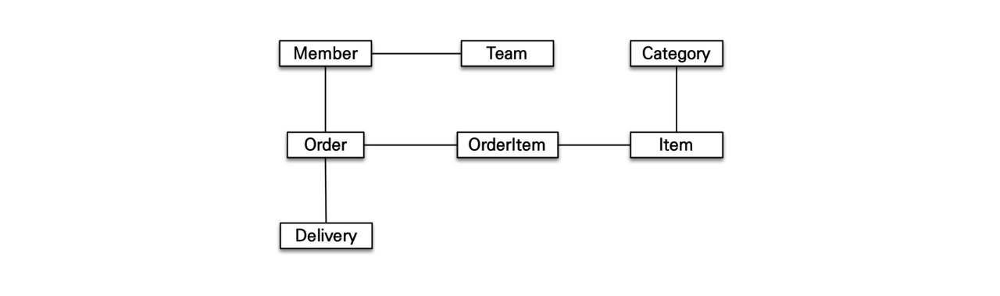
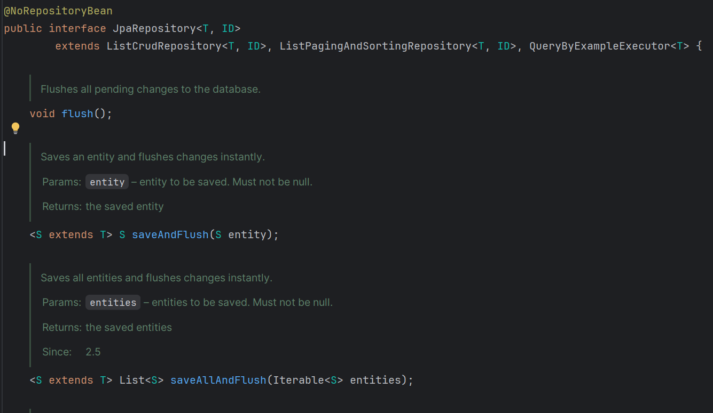
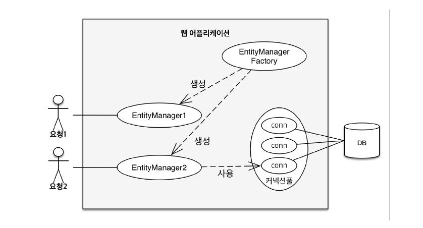
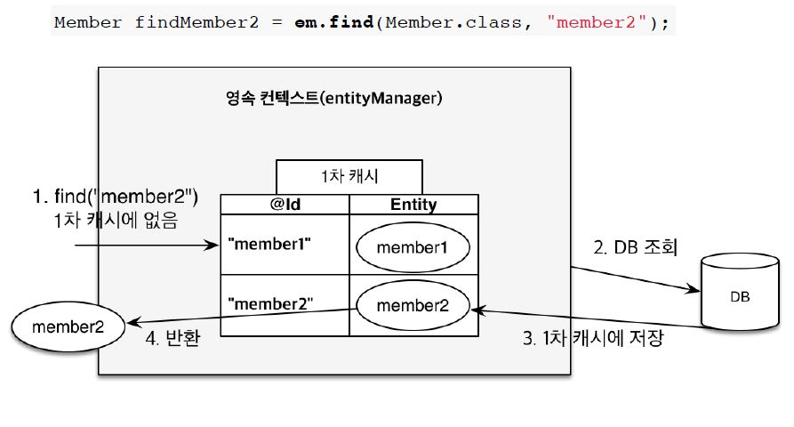
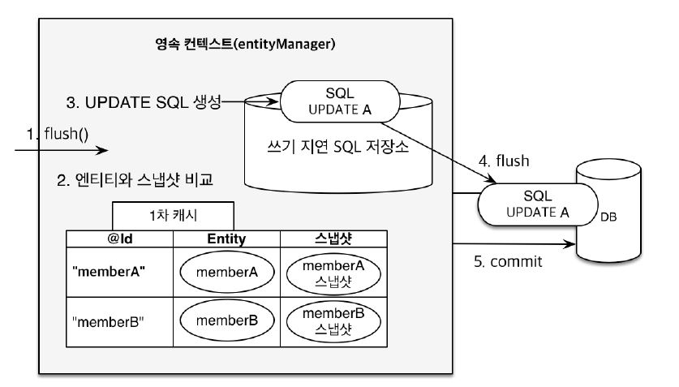
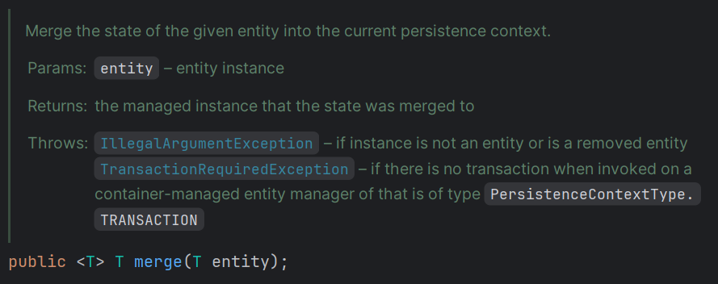
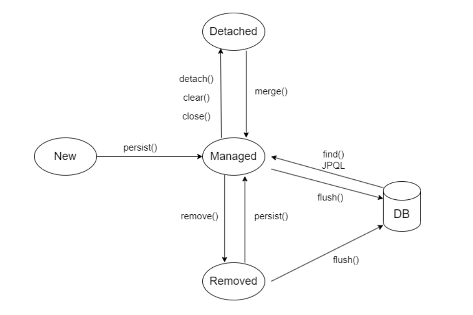

## 🍀 ORM은 무엇일까요? 스프링에서 ORM을 어떻게 이용할 수 있을까요?

### 1. ORM은 무엇일까요?
- **ORM은 왜 필요할까요?**  
    > Object-Relational Mapping: 객체와 관계형 데이터를 매핑하기 위한 기술</br>
    > 개발자가 SQL을 직접 작성하지 않고, 객체 지향적인 코드를 통해 데이터 작업을 수행하도록 도와준다.
    - **패러다임의 불일치**
        - 객체와 관계형 데이터베이스가 지닌 성질(패러다임)의 불일치가 발생한다.
        - 따라서 불일치를 해결하기 위해서는 많은 시간과 코드들이 소비된다. 

        | 구분 | 객체(Object) | 테이블(Table) | 설명 |
        |------|--------------|---------------|--------------|
        | **상속** | 상속 기능 지원 (`extends`) | 상속 개념 없음 | 객체의 상속 구조를 테이블로 직접 표현 불가 |
        | **연관관계** | 참조(Reference)로 다른 객체와 연관 | 외래키(Foreign Key)로 다른 테이블과 연관 | 참조 vs FK 표현 차이 |
        | **탐색 방식** | 객체 그래프 탐색 가능 (`member.getOrder()`) | 최초 실행된 SQL 기준으로 탐색 한정 | 그래프 탐색 ↔ SQL 결과 불일치 |
        | **식별 방식** | 동일성(==), 동등성(`equals`) 비교 | 기본 키(PK)로 행 구분 | 객체의 비교 개념과 테이블의 식별 개념 차이 |

        

    - **ORM의 등장**
        - 위와 같은 객체와 관계형 데이터 간의 차이를 해소하기위해 ORM 기술이 도입되었다.

- **ORM의 장단점은 무엇일까요?**  

  - **장점**  
    1. **객체와 데이터베이스 매핑 자동화**  
       → 객체 지향 설계를 그대로 유지하면서 DB에 저장이 가능하다
    2. **연관관계 관리 간소화**  
       → ORM이 FK를 자동으로 관리하고, 객체 참조를 SQL로 변환하여 개발자의 SQL 작성 부담이 감소한다.
    3. **재사용성과 유지보수성 향상**  
       → ORM은 독립적으로 작성되어 재사용이 쉽고, 수정 및 유지보수에 용이하다

  - **단점**  
    1. **세밀한 매핑 설계 필요**  
       → 잘못 설계하면 성능 저하가 발생할 수 있다.
    2. **복잡 쿼리 한계**  
       → 복잡한 JOIN, 집계, 특수 SQL 함수는 결국 SQL/JPQL을 직접 작성할 필요가 있다.  
    3. **학습 곡선 존재**  
       → 영속성 컨텍스트, 지연 로딩 등 동작 원리를 이해하지 못하면 예기치 못한 오류 발생할 수 있다.


### 2. 스프링에서 ORM을 어떻게 활용하나요?
- **Spring Data JPA란 무엇이고 어떤 기능을 제공할까요?**  
    > ORM 기술인 JPA(Jakarta Persistence API)를 위한 레파지토리 지원을 제공한다.</br>
    > 일관된 프로그래밍 모델을 제공하여 개발을 더 쉽게 만들어 준다.
    1. ORM 기술 지원
    2. 페이징 및 정렬
    3. CRUD 메서드 생성 및 수행
    4. 쿼리 메서드 생성 및 수행
- **Repository Layer란 무엇일까요?**  
    - 비즈니스 로직이 DB에 접근하는데 문제가 발생할 수 있다. (ex 코드 복잡도 증가, 이동하는 데이터의 정보 식별 어려움)
    - 비즈니스 로직과 분리된, 오직 **데이터 접근 로직을 담당하는 계층**을 고안
    - 비즈니스 로직은 **추상화된 인터페이스에 의존**하고, 실제 구현체은 Repository가 담당
- **JpaRepository 인터페이스에는 어떤 기능들이 포함되어 있나요?**  
    - ListCrudRepository, ListPagingAndSortingRepository, QueryByExampleExecutor 인터페이스를 상속받는다.

    

    1. **ListCrudRepository<T, ID>**  
        - 기본 CRUD 기능 제공 (`count`, `delete`, `deleteAll`, `deleteAllById` 등)  
        - `List` 형식 지원 (`findAll`, `findAllById`, `saveAll` 등)

    2. **ListPagingAndSortingRepository<T, ID>**  
        - `CrudRepository`의 확장 인터페이스로 **페이징과 정렬 기능 제공**  
        - 주요 메서드: `findAll(Sort sort)`, `findAll(Pageable pageable)`

    3. **QueryByExampleExecutor<T>**  
        - Example 객체 기반 **동적 쿼리 생성 기능 제공**  
        - 주요 메서드: `findOne`, `findAll`, `exists`, `count`  

    4. **영속성 컨텍스트 관련 메서드 (JpaRepository)**  
        - `flush` : 영속성 컨텍스트 내용을 DB에 반영  
        - `saveAndFlush` : 엔티티 저장 후 즉시 반영  
        - `deleteInBatch` : 여러 엔티티를 일괄 삭제


---

## 🍀 영속성 컨텍스트는 무엇일까요?
> - 애플리케이션과 데이터베이스 사이에서 **엔티티 객체를 보관하는 가상의 데이터베이스 같은 역할**  
> - `EntityManager`를 통해 엔티티를 영속성 컨텍스트에 보관하고 관리
> 
>   

### 1. 영속성 컨텍스트의 생명주기는 어떻게 되나요?
1. **비영속(new)**  
   - `User user = new User();`  
   - 단순히 객체만 생성된 상태  
   - 아직 영속성 컨텍스트와 관계 없다.

2. **영속(managed)**  
   - `EntityManager.persist(user);`  
   - 엔티티가 영속성 컨텍스트에 저장되고 관리되는 상태  

3. **준영속(detached)**  
   - 엔티티가 한 번 영속되었다가 컨텍스트와 분리된 상태  
   - 예시:
     - `EntityManager.detach(user);` : 특정 엔티티만 준영속 상태로 변환  
     - `EntityManager.clear();` : 영속성 컨텍스트 초기화  
     - `EntityManager.close();` : 영속성 컨텍스트 종료  
   - 이 상태에서는 영속성 컨텍스트가 엔티티를 더 이상 관리하지 않음  

4. **삭제(removed)**  
   - 영속성 컨텍스트에서 엔티티가 제거된 상태  
   - DB에서도 실제 삭제가 반영됨

### 2. 영속성 컨텍스트의 특징
1. **1차 캐시와 동일성 보장**  
   - 영속성 컨텍스트는 **1차 캐시**를 내부에 가지고 있다. (Map 구조: key=PK, value=엔티티)  
   - 조회 시 동작 과정:  
     1. 먼저 1차 캐시에서 엔티티 조회  
     2. 없으면 DB에서 가져와 1차 캐시에 저장 후 반환  
   - 트랜잭션마다 독립적인 `EntityManager`와 영속성 컨텍스트를 사용한다.
   - 같은 트랜잭션 내에서는 동일성을 보장 → 같은 엔티티는 항상 동일 객체(`==`)로 참조 한다. 

      

2. **쓰기 지연 SQL 저장소와 변경 감지**  
   - `persist()` 호출 시:  
     - 엔티티는 1차 캐시에 저장  
     - INSERT SQL은 쓰기 지연 SQL 저장소에 쌓임  
   - 실제 SQL 전송 시점:  
     - `transaction.commit()`  
     - `EntityManager.flush()`  
   - 커밋 시 flush가 발생하면서 쌓아둔 SQL이 한 번에 DB로 전송됨 → 네트워크 부하 감소  
   - **변경 감지(Dirty Checking)**:  
     - 최초 저장된 스냅샷과 현재 엔티티 상태를 비교  
     - 값이 변경되면 UPDATE SQL이 자동 생성되어 flush 시 DB 반영
     > *따라서 데이터를 변경하는 로직에서는 저장하는 로직을 추가하지 않아도 된다.*

     

### 3. 플러시(Flush)란 무엇인가요?
> **정의:** 영속성 컨텍스트의 변경 내용을 DB에 반영하는 것  
> *flush 후에도 영속성 컨텍스트는 비워지지 않는다.*
- **발생 시점**  
  1. 사용자가 직접 호출: `EntityManager.flush()`  
  2. 트랜잭션 커밋 시 자동 호출 
    → *`@Transactional` 영억 종료 시 transaction.commit()이 호출된다.*
  3. JPQL 실행 전 자동 호출 (JQPL은 쿼리문을 DB에 직접 실행하기 때문이다.)

### 4. 준영속 상태의 특징과 merge()의 동작
- **준영속 상태**  
  - 영속성 컨텍스트에서 분리된 엔티티 상태  
  - 더 이상 영속성 컨텍스트 기능을 사용할 수 없다.
  - **핵심**: 식별자(PK)를 기준으로 영속된 적이 있는 엔티티인지 여부로 판단  한다.

- **준영속 엔티티 수정 방법**  
  1. **변경 감지 활용**  
     - 동일 식별자를 가진 엔티티를 영속 상태로 다시 조회한다.  
     - 조회한 영속 엔티티에 변경 사항을 반영한다.
  2. **병합(merge) 사용**  
     - 동작 과정:  
       1. `merge(item)` 호출  
       2. 1차 캐시에서 해당 식별자를 가진 영속 엔티티 조회  
       3. 조회한 영속 엔티티의 값을 준영속 엔티티 값으로 갱신  
       4. 병합된 영속 엔티티 반환  
     - **단점**: `merge()`는 파라미터로 객체를 넘겨주기 때문에 모든 데이터를 전달해야 한다.

        

---

## 🍀 Entity는 무엇이고 생명주기는 어떻게 되나요? 생성자 패턴이 무엇일까요?

### 1. Entity는 무엇인가요?
- 정의: JPA가 관리하는 객체
- **Entity의 생명주기**  
    - 비영속(new/transient) = 영속성 컨텍스트와 전혀 관계가 없는 상태
    - 영속(managed) = 영속성 컨텍스트에 저장된 상태
    - 준영속(detached) = 영속성 컨텍스트에 저장되었다가 분리된 상태
    - 삭제(removed) = 삭제된 상태

    > </br>
    > *영속성 컨텍스트와 거의 동일하다.*

- **Entity 관련 어노테이션**  
    | 어노테이션 | 설명 |
    |-----------|------|
    | @Table | 엔티티와 매핑될 테이블 이름 및 속성 설정 |
    | @Entity | 해당 클래스를 JPA 엔티티로 지정 |
    | @Id | PK 필드 지정 |
    | @GeneratedValue | 기본 키 값 자동 생성 설정 |
    | @Column | 해당 필드를 테이블 컬럼에 매핑 및 속성 설정 |
    | @Getter | 필드를 조회 |
    | @NoArgsConstructor | 기본 생성자를 추가하되, 접근제한을 걸어서 안전성을 향상 |
    | @ManyToOne, @OneToMany | 연관관계 매핑을 위해 사용 |
    | @Builder | 빌더 패던을 사용하기 위해 사용 |

### 2. Entity 객체 생성 방법
- **생성자 방식**
    > 필드를 매개변수로 받는 생성자를 통해 객체를 생성
    - 장점:
        1. 간단하고 직관적이다.
    - 단점:
        1. 필드가 많아질수록 매개변수 순서를 헷갈릴 수 있다.
        2. 코드가 못생겨진다.

- **팩토리 메서드 방식**
    > 객체 생성 로직을 `static` 메서드나 별도의 팩토리 클래스에서 제공</br>
    > 생성자 호출을 감추고 의미 있는 메서드명으로 객체 생성을 표현

    ```java 
      public class Coffee {
        private String name;
        private double price;

        private Coffee(String name, double price) {
            this.name = name;
            this.price = price;
        }

        public static Coffee create(String name, double price) {
          return new Coffee(name, price);
        }
      }

      // 객체 생성 시
      Coffee coffee = Coffee.create("Americano", 2000);
    ```
    - 장점:
        1. 객체 생성 코드를 한 곳에 모아 코드 중복을 제거할 수 있다,
        2. 스프링과 같은 프레임워크에서 의존성 주입을 통해 더 깔끔하게 코드를 관리할 수 있다.

- **빌더 패턴**
    > `@Builder`를 사용하여 객체를 생성
    ```java
      @Getter
      @NoArgsConstructor(access = AccessLevel.PROTECTED)
      public class Coffee {
          private String name;
          private double price;
          
          @Builder
          public Coffee(String name, double price) {
              this.name = name;
              this.price = price;
          }
      }

      // 객체 생성 시
      Coffee coffee = Coffee.builder()
            .name("Americano")
            .price(2000)
            .build();      
    ```
    - 장점:
        1. 필드가 많아도 가독성이 높고, 유지보수성이 좋다.
        2. 매개변수를 순서에 상관없이 넣을 수 있다. → 점층적 생성자 제거
    - 단점:
        1. 빌더 코드 자체가 길어질 수 있고, 작은 객체에는 다소 과한 방식일 수 있다.

- **팩토리 메서드 VS 빌더 패턴**

  | 구분 | 팩토리 메서드 패턴 | 빌더 패턴 |
  |------|-----------------|-------------|
  | **의도** | 생성자를 감추고 **의미 있는 static 메서드명**으로 객체를 생성 | **많은 매개변수**나 선택적 매개변수를 명확하게 전달 |
  | **특징** | - 객체 생성 코드를 한 곳에 모아 관리<br>- 유효성 검사/로직 추가 가능<br>- new 키워드 대신 의미 있는 이름 사용 가능 | - 어떤 값이 어떤 필드에 들어가는지 **가독성 ↑**<br>- 매개변수가 많아도 안정적<br>- 선택적 매개변수 처리에 유연 |
  | **적합한 경우** | - 단순한 객체 생성 시<br>- 생성 과정에 **유효성 검사**나 **추가 로직** 필요할 때 | - 필드가 많고, 선택적 인자가 많을 때<br>- **가독성과 유연성**이 중요한 경우 |

---

## 🍀 연관관계 매핑은 무엇이고 어떻게 활용할 수 있을까요?

### 1. 연관관계 매핑은 왜 필요할까요? 꼭 사용해야 할까요?
- **필요한 이유**  
  1. 객체는 참조(Reference)로 연관관계를 표현하지만, RDB는 외래 키(FK)로 연관관계를 표현한다.  
     → 이 패러다임 불일치를 해결하기 위해 매핑이 필요하다.  
  2. 매핑을 사용하면 객체 그래프 탐색(`order.getMember()`)처럼 **객체 지향적인 코드**로 데이터를 다룰 수 있다.  
  3. JPA가 FK 관리, 조인 처리, 지연 로딩 등을 자동화해주므로 개발자는 **비즈니스 로직에 집중**할 수 있다.  

- **꼭 사용해야 할까?**  
  - 단순히 ID 값만 다루고 연관된 엔티티를 조회할 필요가 없다면, 연관관계 매핑 없이 **단순 필드(Long memberId)** 로 처리할 수도 있다.  
  - 그러나 대부분의 실무에서는 엔티티 그래프 탐색과 함께 조회가 필요하기 때문에 **연관관계 매핑을 사용하는 것이 권장**된다.  
  - 결론: *필수는 아니지만 객체 지향적 설계, 유지보수성, 생산성을 위해 사실상 필요하다.*

### 2. 연관관계 매핑의 종류
- **단방향**: 한쪽 엔티티만 다른 엔티티를 참조  
- **양방향**: 두 엔티티가 서로 참조 → 양쪽에서 조회 가능  
- **@ManyToOne**: 다대일(N:1)  
- **@OneToMany**: 일대다(1:N)  
- **@OneToOne**: 일대일(1:1)  
- **@ManyToMany**: 다대다(N:N, 보통 연결 테이블 필요)

### 3. 양방향 연관관계 설정 시 주의사항
- **연관관계의 주인(Owner) 지정**  
  - 양방향 관계에서는 두 엔티티 모두 FK를 가질 수 있으므로 **혼란을 방지하기 위해 주인을 명시**해야 한다.  
  - 주인은 실제 DB에 FK를 가지는 테이블에 해당하며, 주인이 아닌 쪽은 `mappedBy` 속성으로 주인을 지정한다.  
  - 일반적으로 **N:1 관계에서는 N쪽이 연관관계의 주인**이 된다. 
  ```java
    // User와 Assignment 연관관계(1:N)

    // User 테이블
    @OneToMany(mappedBy = "user", cascade = CascadeType.ALL, orphanRemoval = true, fetch = FetchType.LAZY)
    private List<Assignment> assignmentList =  new ArrayList<>();

    // Assignment 테이블(FK 주인)
    @ManyToOne(fetch = FetchType.LAZY)
    @JoinColumn(name = "user_id")
    private User user;
  ```

### 4. 영속성 전이와 활용
- **CASCADE 옵션**  
  > 부모 엔티티를 영속화할 때 연관된 자식 엔티티도 함께 영속 상태로 만들고 싶을 때 사용한다.</br>
  > 예: 게시글(Post)을 저장할 때, 연관된 댓글(Comment)도 함께 저장되도록 설정 가능 

    | 옵션 | 설명 |
    |-----------|------|
    | CascadeType.ALL | 모든 Cascade 옵션을 적용 |
    | CascadeType.PERSIST | 엔티티를 영속화할 때, 연관된 엔티티도 함께 영속화 |
    | CascadeType.REMOVE | 엔티티를 제거할 때, 연관된 엔티티도 함께 제거 |
    | CascadeType.MERGE | 엔티티 상태를 병합할 때, 연관된 엔티티도 함께 병합 |
    | CascadeType.REFRESH | 부모 엔티티를 Refresh하면, 연관된 엔티티도 함께 Refresh |
    | CascadeType.DETACH | 부모 엔티티를 Detach하면, 연관된 엔티티도 함께 Detach |

- **orphanRemoval과 CASCADE.REMOVE의 차이**  
    - **고아객체**: 부모 엔티티와 연관관계가 끊어진 자식 엔티티
    - **공통점**
      1. 부모 엔티티가 삭제되면 자식 엔티티도 삭제된다. → *부모가 자식의 삭제 생명 주기를 관리한다.*
      2. 연관관계 변경 시 자식은 단순히 연관만 끊기고, DB에는 여전히 남아 있다 → *UPDATE 쿼리 실행* 

    - **차이점**
      - **CascadeType.REMOVE**: 부모와 자식 관계가 끊어져도 자식 엔티티는 삭제되지 않고 DB에 남는다.  
      - **orphanRemoval=true**: 부모와 자식 관계가 끊어지면 자식 엔티티는 고아 객체로 간주되어 DB에서 삭제된다.  

    - **주의점**
      - `orphanRemoval`은 자식이 **하나의 부모에만 속할 때** 사용해야 한다.  
      - 하나의 자식 엔티티가 여러 부모 엔티티와 연관된 경우, `orphanRemoval`을 사용하면 의도치 않게 자식 엔티티가 삭제될 수 있다.  