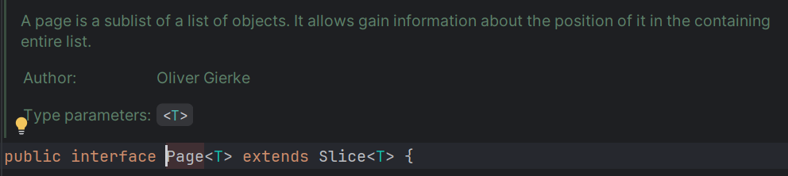
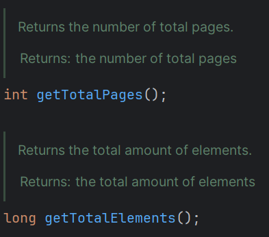

### **🍀 쿼리 메서드와 JPQL은 어떻게 사용할까요?**

1. **Spring Data JPA 쿼리 메서드는 어떤 규칙에 따라 작성하며, 어떤 방식으로 동작할까요?**
    - **작성 규칙**
        - 메서드의 이름을 분석해 자동으로 쿼리문을 작성한다.
        - 기본 구조: `get` / `find` / `delete` + `By` + **필드명** (+ `OrderBy필드명Asc/Desc`)
        - 메서드 이름은 **카멜 케이스**를 기준으로 단어를 분리해 인식한다.  
        - 예: `findByUsernameAndAgeGreaterThan(String username, int age)`
        > JPA Query Methods 공식 문서</br>
        > https://docs.spring.io/spring-data/jpa/reference/jpa/query-methods.html
    - **작동 방식**
        1. 리포지토리 인터페이스 메서드 선언  
        2. JPA가 메서드 명을 파싱해 JPQL 생성  
        3. 실행 시점에 JPQL을 SQL로 변환하여 DB에 전달

2. **쿼리 메서드만으로는 해결하기 어려울 때, @Query와 JPQL을 어떻게 활용할 수 있을까요?**
    1. **JPQL과 Native Query의 차이점은 무엇이고, 각각 언제 사용하는 것이 적절할까요?**
        - **JPQL**
            - 엔티티와 필드명을 기반으로 작성한다 (객체 지향적).
            - 엔티티 기반 작성 → DB 교체·스키마 변경 시 수정 최소화할 수 있다.
            - 연관 엔티티를 객체 참조로 조회 가능하다.
            - 코드를 작성하는 시점에서 빠르게 오류를 발견할 수 있다.
            - **단점**
                - 모든 SQL 기능을 지원하는 것은 아니다.
                - 여러 조인이나 복잡한 쿼리를 작성하기 어렵다.
                - DB 벤더 종속적 기능(윈도우 함수, CTE, 힌트 등)은 불가능하다.
        
        - **Native Query**
            - 실제 DB에서 쿼리를 실행한다.
            - 모든 SQL 기능을 사용할 수 있다.
            - 여러 조인이나 복잡한 쿼리를 작성할 때 직관적이고 이해하기 쉽다.
            - **단점**
                - DB 변경 시 쿼리를 다시 만들어야한다.
                - 엔티티 매핑이 어렵고 반환 타입이 제한적이다.
                - 따로 파라미터 바인딩을 해야한다.

        - ***일반적인 조회(=JPQL) vs 성능 최적화나 특수 SQL 기능이 필요(=Native Query)***

    2. **JPQL에서 사용하는 파라미터 바인딩 방법에는 무엇이 있나요?**
        1. TypedQuery -> 반환형이 명확할 때 사용한다.
            > 매개변수에 객체 클래스 정보가 들어간다.

            ```java
            TypedQuery<User> query = em.createQuery("SELECT u FROM USER u", User.class)
            ```

        2. Query -> 반환형이 명확하지 않을 때 사용한다.
            > 매개변수에 객체 클래스 정보가 들어가지 않는다.

            ```java
            Query query = em.createQuery("SELECT u.username, u.age FROM USER u")
            ```

        - 파라미터 바인딩이란
            > 쿼리에 작성되는 특정 속성을 매개변수로 매핑하는 것
            1. 이름 기반 바인딩
                - `=:` 연산자를 사용한다

                ```java
                Query query = em.createQuery("SELECT u FROM User u where u.username =: username")
                    .setParameter("username", usernameParam);
                ```
            2. 위치 기반 바인딩
                - `=?` 연산자를 사용한다

                ```java
                Query query = em.createQuery("SELECT u FROM User u where u.username =? 1")
                    .setParameter(1, usernameParam);
                ```
            
            3. 권장 방법
                - 이름 기반 바인딩을 사용하는 것이 권장된다.
                - 중간에 새로운 매개변수를 추가하는 경우, 순서가 밀리기 때문에 잘못된 데이터를 조회할 수 있다.
                - 또한 숫자를 통해 표현하는 것보다 이름으로 표현하는 것이 가독성이 좋다.
            
    3. **@Modifying은 무엇이고 언제 필요할까요?** 
        - **정의**
            - @Query를 통해 작성된 변경이 일어나는 쿼리(INSERT, DELETE, UPDATE )를 실행할 때 사용된다.
            - JPA의 변경 감지를 생략하고 바로 DB에 반영한다.
        - **옵션**
            1. flushAutomatically
                - 해당 쿼리를 실행하기 전, 영속성 컨텍스트의 변경을 flush 한다.
                - default = false
            2. clearAutomatically
                - 해당 쿼리를 실행한 후, 영속성 컨텍스트를 clear 한다.
                - default = false    
        - **벌크 연산**
            - 벌크 연산이란? UPDATE, DELETE 시 대량의 데이터를 한 번에 처리하기 위한 작업
        - **주의사항**
            - 벌크 연산은 **영속성 컨텍스트(1차 캐시)를 무시**하고 DB에 직접 반영된다.  
            - 이로 인해 **1차 캐시와 DB 간 데이터 불일치**가 발생할 수 있다.
            - `@Modifying(clearAutomatically = true)` 옵션으로 연산 후 캐시를 초기화해야한다.
            - 변경 작업은 반드시 `@Transactional` 내에서 실행


3. **JPA에서 제공하는 페이징과 정렬은 어떻게 구현할 수 있을까요?**
    - **Paging**

        ``` java
        // Service
        // PageRequest.of(page, size, sort)로 pageable 생성
        Pageable pageable = PageRequest.of(0, 20, Sort.by("createdAt").descending());
        Page<User> page = userRepository.findByGrade(Grade.Silver, pageable);

        // Repository
        Page<User> findByGrade(Grade grade, Pageable pageable);
        ```

    - **Sort**

        ``` java
        // Service
        // Sort.by(sort, field)로 sort 생성
        Sort sort = Sort.by(Sort.Direction.DESC, "createdAt");
        List<User> users = userRepository.findAll(sort);

        // Repository
        List<User> findAll(Sort sort);
        ```


    1. **Page와 Slice는 어떤 차이가 있으며, 각각 어떤 경우에 선택하는 것이 좋을까요?** 

        - 둘 다 **Pageable**를 인자로 받아 동작한다.
            ```java
            Page<Post>  findByGrade(Grade grade, Pageable pageable);
            Slice<Post> findByGrade(Grade grade, Pageable pageable);
            ```

            

            > Page는 Slice를 상속한다.

            

            > 전체 데이터 개수(getTotalElements()) </br>
            > 전체 페이지 개수(getTotalPages()) </br>
            > Page = Slice + count 연산

        | 구분       | Page                                       | Slice                    |
        | -------- | ------------------------------------------ | ------------------------ |
        | count 쿼리 | 실행함 (총 개수/총 페이지 계산)                        | 실행하지 않음                  |
        | 반환 정보    | `getTotalElements()`, `getTotalPages()` 제공 | `hasNext()` 만 제공 (총계 없음) |
        | 성능       | 상대적으로 비용 높음 (count 쿼리 추가)                    | 비용 낮음                     |
        | 사용처      | 페이지 네비게이션(끝 페이지, 전체 건수 필요)                 | 무한 스크롤/다음 페이지 여부만 필요 |

        - ***끝 페이지/전체 건수가 필요하면 **Page**, 아니면 **Slice**로 비용을 절감한다.***


4. **쿼리를 작성할 때, 성능 측면에서 고려해야 할 사항으로는 무엇이 있을까요?** 
    1. **findAll()을 무분별하게 사용할 때 어떤 성능 이슈가 발생하고, 이를 어떻게 개선할 수 있을까요?** 
        - **문제점**
            1. **I/O 폭증**: 테이블 전체를 읽기 때문에 디스크와 메모지 자원이 낭비된다.
            2. **네트워크 전송량 증가**: 필요 없는 데이터를 다 가져오므로 네트워크 비용이 커진다.
            3. **N+1**: 연관된 엔티티를 지연 로딩으로 꺼내면, 루프마다 추가 쿼리가 발생할 수 있다.
        - **개선 방법**
            - `findBy...()` 처럼 조건을 지정해서 필요한 데이터만 가져온다.
            - 엔티티 전체가 아닌 필요한 필드만 조회한다.

                ```java
                public interface UserSummary {
                    Long getUserId();
                    String getName();
                    String getAddress();
                }

                Page<UserSummary> findByGrade(Grade grade, Pageable pageable);
                ```

    2. **데이터를 DB에서 처리하는 것과 자바 코드에서 처리하는 것에 어떤 차이가 있을까요?** 
        - DB에서 처리할 때
            - 필터링(`WHERE`), 정렬(`ORDER BY`), 집계(`GROUPD BY`, `COUNT`), JOIN을 DB에서 처리하므로 넘어오는 데이터량이 감소한다.
            - 복잡한 비즈니스 로직이나 외부 연동은 SQL로 표현하기 어렵다.

        - 자바 코드에서 처리할 때
            - 비즈니스 로직이 복잡하거나, DB보다는 코드로 표현하는 게 직관적일 때 적합하다.
            - 가져오는 데이터가 소량일 때 편리하다.
            - 대량의 데이터를 가져오는 경우 I/O 비용이 증가한다.

### **🍀 N+1 문제는 무엇이 어떻게 대처해야 할까요?**

1. **N+1 문제란 무엇이고 왜 발생하나요?**
    - 1번의 메인 쿼리로 N개의 엔티티를 가져온 뒤, 각 엔티티의 연관 엔티티를 지연 로딩하여 N개의 추가 쿼리가 발생하는 것
    - 연관관계가 LAZY일 때, 컬렉션/연관 객체에 반복 접근하면서 매번 초기화 쿼리가 발생.
    - 연관관계가 EAGER일 때도, 계층적으로 추가 연관까지 연쇄 로딩되며 쿼리가 폭증하거나, 상황에 따라 N+1로 이어질 수 있음.

    1. **즉시 로딩(EAGER)과 지연 로딩(LAZY)의 차이는 무엇인가요?**
        - **즉시 로딩**
            - 엔티티를 가져오는 시점에 연관 엔티티까지 즉시 가져오는 전략
            - 코드 접근 시 추가 쿼리 없이 사용 가능하다.
            - 불필요한 조인 및 로딩이 일어날 수 있다.
            - 상황에 따라 N+1이 발생할 수 있다.

        - **지연 로딩**
            - 엔티티를 가져오는 시점에 연관 엔티티를 프록시 객체로 불러오고, 조회 시 참조를 통해 DB에서 불러오는 전략
            - 필요할 때만 가져와서 효율적으로 메모리를 관리할 수 있다.
            - 반복문 + 접근 패턴에서 N+1을 유발한다.

        - **JPA 기본값**
            - @ManyToOne, @OneToOne 기본 EAGER
            - @OneToMany, @ManyToMany 기본 LAZY

    
2. **N+1 문제를 해결하는 방법에는 무엇이 있을까요?** 
    1. **Fetch Join과 일반 Join의 차이는 무엇일까요?**
        - **일반 JOIN**
        
        ```java
        SELECT u FROM User u JOIN u.order o WHERE o.status = :status
        ```
        > 필터링 및 조건에는 존재하지만, 엔티티 그래프는 초기화되지 않을 수 있다. → 여전히 LAZY

        - **FETCH JOIN**
        ```java
        SELECT DISTINCT u FROM User u JOIN FETCH u.order WHERE o.status = :status
        ```
        > 연관 엔티티를 한 번에 로딩한다.(영속성 컨텍스트에 같이 탑재)</br>
        > N+1문제를 해결할 수 있다.

        - **주의할 점**
            - To-One(`ManyToOne`/`OneToOne`)은 fetch join + 페이징 안전한 편.
            - To-Many(`OneToMany`/`ManyToMany`)를 fetch join + 페이징하면 행 폭증/페이징 깨짐.
            - 컬렉션 조인 시에는 select distinct 붙여야 중복 제거 가능.

    2. **Fetch Join과 Batch Size은 각각 어떤 방식으로 N+1 문제를 해결할까요?** 
        - **FETCH JOIN**
            - 1개의 쿼리문으로 연관 엔티티까지 조인해서 한 번에 가져온다.
            - 가장 단순하고 빠른 경우가 많다. (특히 To-One).
            - 컬렉션 fetch join 시, 페이징이 불가능하다. (행 중복)
            - 리스트 두 개 이상 동시 fetch join 시, **MultipleBagFetchException**이 발생한다.

        - **Batch Size**
            - 지연 초기화가 필요한 프록시/컬렉션들을 묶어서 `... where parent_id in (?,?,...,?)` 형태로 한 번에 가져온다.
            - K ≈ 1 + ⌈N / batch_size⌉ 로 쿼리 수가 줄어든다.
            - 컬렉션에도 잘 맞고, 페이징과 궁합이 좋다.
            - 여전히 여러 번의 쿼리가 발생한다.

            ```java
            // User 엔티티의 필드
            @BatchSize(size = 100)
            private List<Order> order;
            ```
    3. **@EntityGraph를 사용하면 어떤 방식으로 문제를 해결할 수 있을까요?**
        - @EntityGraph는 JPA에서 fetch 조인을 어노테이션으로 사용할 수 있도록 만들어 준 기능이다.

        ```java
        // OrderRepository
        @EntityGraph(attributePaths = {"user"})
        Page<Order> findByStatus(OrderStatus status, Pageable pageable);
        ```

        - **2가지** 유형이 있다.
            1. **FETCH(default)**: 명시한 attribute는 EAGER로 패치, 나머지는 LAZY로 패치
            2. **LOAD**:  명시한 attribute는 EAGER로 패치, 나머지는 entity에 명시한 fetch type이나 디폴트 FetchType으로 패치

### 번외

1. `@EnableJpaAuditing`에 대하여
    - 엔티티의 생성 및 수정 시점에 대한 정보를 자동으로 관리하기 위한 설정이다. 
    - **BaseEntity**에 다음과 같은 필드를 두어 추적한다:  
        - `createdAt` (생성일)  
        - `modifiedAt` (수정일)  
        - `createdBy` (생성자)  
        - `modifiedBy` (수정자)
    - **Application 클래스**에 `@EnableJpaAuditing`을 등록하여 자동으로 값을 주입할 수 있다.
    - 생성일과 수정일은 `@CreatedDate`, `@LastModifiedDate` 어노테이션을 탐색해 엔티티 이벤트 발생시 해당 값을 자동으로 채워준다.
    - 생성자와 수정자와 같은 사용자 정보는 **별도의 설정 클래스(Config)**을 통해서 주입해야한다.
