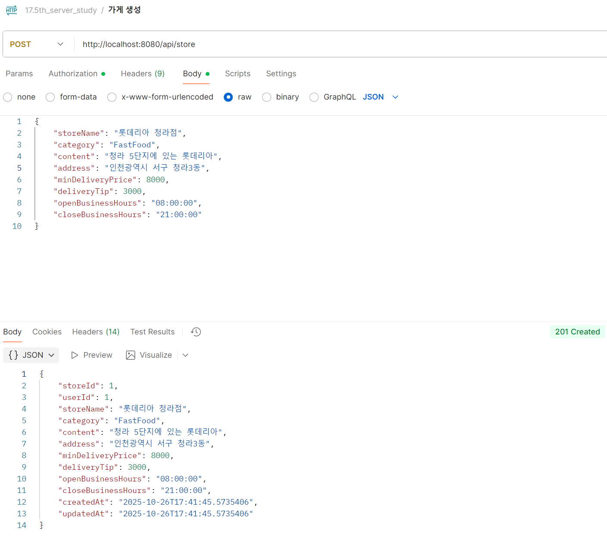
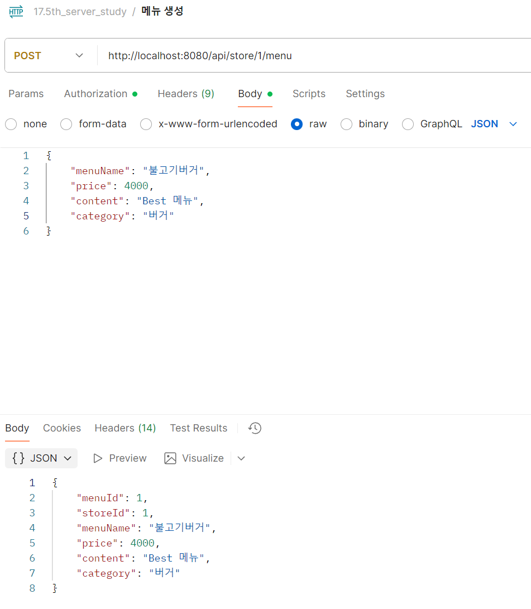

### 🍀 Controller Layer는 무엇인가요?

1. **Controller Layer는 어떤 역할을 하며, 어떤 구조로 이루어져 있나요?**
    - Spring은 애플리케이션을 **계층화(Layered Architecture)** 하여 각 계층이 명확한 책임을 갖도록 구성한다.

        

        > - **Presentation Layer**: Spring MVC 패턴을 통해 사용자의 요청을 처리하여 응답을 생성
        > - **Business Layer**: 요청에 필요한 핵심 기능과 규칙(비즈니스 로직)을 구현하고 관리
        > - **Data Access Layer**: 데이터의 영속성을 관리하고 CRUD 작업을 수행

    - **Controller의 주요 역할**
        1. **클라이언트 요청 수신**</br>
            → 사용자의 HTTP 요청을 받고 요청 URL, 메서드, 파라미터를 분석한다.

        2. **Service 호출**</br>
            → 해당 요청을 처리할 비즈니스 로직(Service) 을 실행한다.

        3. **응답 생성 및 반환**</br>
            → 처리 결과를 ResponseEntity 등을 통해 클라이언트에게 반환한다.

2. **ResponseEntity는 무엇이며, 어떻게 활용할 수 있나요?**
    - `ResponseEntity`는 **Spring Framework**에서 제공하는 클래스로, HTTP 요청에 대한 응답을 구성하는 데 사용된다.
    - 상위 클래스인 `HttpEntity`를 상속받아 `Body`, `Header` 및 별도의 `Status Code`를 포함할 수 있어, 세밀한 응답 관리가 가능하다.

    1. **HttpStatus**
        - 클라이언트의 요청에 대한 처리 상태를 나타내는 코드
        - `200 OK`, `400 Bad Request`, `404 Not Found` 등과 같은 상태 코드를 명시적으로 지정
    2. **HttpHeader**
        - 응답에 대한 메타데이터를 포함
        - 응답의 Content-Type, 캐싱 정보, CORS 관련 설정, 인증 토큰 등 다양한 HTTP 헤더를 응답에 추가하거나 수정
    3. **HttpBody**
        - 클라이언트에게 실저로 전달하려는 응답 데이터
        - 주로 JSON 또는 XML 형식의 실제 데이터

    - **ResponseEntity 생성 방식**
    ```java
    // 1. 상태 코드(숫자) + Body
    ResponseEntity.status(200).body(user);

    // 2. 상태 코드(미리 정의된 메서드) + Body
    ResponseEntity.ok(user);

    // 3. 상태 코드 + Header + Body
    ResponseEntity.ok().header(headers).body(user);
    ```


### 🍀 Service Layer는 무엇인가요?

1. **Service Layer는 어떤 역할을 하며, 어떤 구조로 이루어져 있나요?**
    - 사용자의 요청을 처리하기 위한 실제 규칙과 기능을 구현하고 트랜잭션을 관리하는 역할을 수행한다.
    - 역할
        1. **비즈니스 로직 구현**
            - 사용자의 요청에 대한 규칙이나 정책을 적용한다.
        2. **트랜잭션 관리**
            - 여러 데이터베이스 작업을 트랜잭션으로 묶어서 처리한다.
            - 이를 통해 데이터의 **일관성**과 **무결성**을 보장한다.
        3. **데이터 흐름 제어 및 조합**
            - Data Access Layer에서 가져온 여러 데이터를 조합하거나 가공한다.
            - Presentation Layer에 적합한 형태로 변환하여 전달한다.

### 🍀 **Spring Bean의 생명주기와 스코프는 무엇인가요?**

1. **Singleton 패턴은 무엇이며, 스프링에서 기본 스코프로 사용되는 이유는 무엇일까요?**
    - 클래스의 인스턴스가 **단 하나만 생성되는 것을 보장**하는 디자인 패턴
    - **장점**
        1. **유일한 인스턴스**
            - 인스턴스가 하나만 존재하므로, 애플리케이션 내의 모든 곳에서 **동일한 인스턴스를 공유**하여 사용할 수 있다.
        2. **메모리 절약**
            - 인스턴스가 재사용되므로, 객체를 생성할 때마다 발생하는 **자원 및 메모리 낭비를 줄여준다.**
        3. **지연 초기화**
            - 최초 호줄 시점에 생성하도록 설계하여, 애플리케이션 시작 시 **불필요한 초기화 비용을 줄일 수 있다.**

    - **단점**
        1. **결합도 증가**
            - 전역 접근이 가능하기 때문에, 해당 인스턴스에 의존하는 코드가 많아질수록 **결합도가 증가**한다.
        2. **테스트 복잡성**
            - 싱글톤 객체는 전역 상태를 공유하므로, **테스트 시 격리(Isolation)** 가 어렵다.
        3. **전역에서 접근 가능**
            - 어디서든 접근이 가능해, 관리되지 않으면 **변경의 복잡성**이 커질 수 있다.

        

    - **Spring에서의 Singleton 관리**
        - Spring은 **IoC 컨테이너**를 통해 객체의 생성과 생명주기를 관리하기 때문에, </br> 
            전통적인 싱글톤 패턴의 단점을 효과적으로 보완할 수 있다.
        - **의존성 주입(DI)** 을 통해 싱글톤 객체를 직접 생성하지 않고 컨테이너에서 주입받습니다.  </br>
            → 결합도를 낮추고, 테스트하기 쉽다.
        - Bean은 **무상태(stateless)** 로 설계하도록 권장된다.  
            - 즉, 멤버 변수에 클라이언트별 데이터를 저장하지 않고 필요한 데이터는 **메서드의 매개변수나 지역 변수로 처리**한다. 
            - 이렇게 하면 여러 스레드가 동시에 접근하더라도 안전하다.

2. **Bean Scope에는 어떤 종류가 있으며, 언제 각각을 사용할까요?**
    1. **Singleton**
        - 기본 스코프, 스프링 컨테이너의 시작과 종료까지 유지되는 가장 넓은 범위의 스코프
        - 무상태로 설계되는 핵심 컴포넌트에 사용된다.
        - 메모리 효율과 성능 측면에서 유리하다.
    2. **Prototype**
        - 스프링 컨테이너는 프로토타입 빈의 생성과 의존관계 주입까지만 관여하고 더는 관리하지 않는 매우 짧은 범위의 스코프
        - 매번 새로운 객체가 필요할 때 사용된다.
        - 사용자가 직접 소멸을 관리해야 한다.
    3. **Request**
        - 웹 요청이 들어오고 나갈때 까지 유지되는 스코프
        - 동시에 여러 HTTP 요청이 오게 되는 경우, 어떤 요청이 남긴 로그인지 구분하기 위해 사용된다.
    4. **Session**
        - 웹 세션이 생성되고 종료될 때 까지 유지되는 스코프
        - 사용자별 세션 정보를 유지해야 할 때 사용된다.
    5. **Application**
        - 서블릿 컨텍스트와 같은 범위로 유지되는 스코프
        - 애플리케이션 전체에서 공유되어야 하는 전역적인 데이터나 설정을 관리하는 데 사용된다.
    
    > *`Requset`, `Session`, `Application` 스코프는 **웹기반 스프링 ApplicationContext** 구현에서만 사용할 수 있다.</br>*
    > *이러한 범위들을 ClassPathXmlApplicationContext같은 보통의 스프링 IoC 컨테이너와 함께 사용한다면 모르는 빈 범위라는 의미로 `IllegalStateException`이 발생한다.</br>*
    
    
    
3. **Spring Bean의 생명주기는 어떻게 이루어질까요?**

    - 스프링 컨테이너 생성 → 스프링 빈 생성 → 의존관계 주입 → **초기화 콜백** → 사용 → **소멸 전 콜백** → 스프링 종료

    1. **스프링 컨테이너 생성(ApplicationContext 생성)**
        - 컨테이너 객체가 생성된다.
        - 컨테이너는 Bean 정의 정보(메타데이터)를 읽어 들인다. (예: @Configuration, @ComponentScan, @Bean, XML 설정 등)
        - 어떤 클래스가 Bean으로 등록되어야 하는지를 파악한다.

    2. **스프링 빈 생성(Bean Insatantiation)**
        - 컨테이너가 등록된 Bean 정의를 바탕으로 빈 객체를 실제로 생성한다.

    3. **의존관계 주입(DI)**
        - 생성된 빈의 생성자를 통해 의존 객체를 주입한다.
        - 모든 의존 관계가 완전히 주입된 후에 초기화 콜백이 호출된다.

    4. **초기화 콜백 및 소멸 전 콜백**
        - 빈 생명주기 콜백 3가지
            1. **인터페이스(InitailizingBean, DisposableBean)**
                ``` java
                public class ExampleBean implements InitializingBean, DisposableBean {
                    
                    @Override   
                    public void afterPropertiesSet() throws Exception {
                        // 초기화 콜백 (의존관계 주입이 끝나면 호출)    
                    }     
                    
                    @Override    
                    public void destroy() throws Exception {        
                        // 소멸 전 콜백 (메모리 반납, 연결 종료와 같은 과정)    
                    }
                }
                ```
                - **InitalizingBean**은 `afterPropertiesSet()` 메소드로 초기화를 지원한다. (의존관계 주입이 끝난 후에 초기화 진행)
                - **DisposableBean**은 `destory()` 메소드로 소멸을 지원한다. (Bean 종료 전에 마무리 작업, 예를 들면 자원 해제(close() 등))
                - 초기화, 소멸 메서드를 override 하기 때문에 **메서드 명을 변경할 수 없다.**
                - 코드를 커스터마이징 할 수 없는 **외부 라이브러리에 적용 불가능**하다.
            
            2. **설정 정보에서 초기화 메서드, 종료 메서드 지정**
                ```java
                public class ExampleBean {     
                    
                    public void initialize() throws Exception {
                        // 초기화 콜백 (의존관계 주입이 끝나면 호출)    
                    }     
                    
                    public void close() throws Exception {
                        // 소멸 전 콜백 (메모리 반납, 연결 종료와 같은 과정)
                    }
                } 
                    
                @Configurationclass LifeCycleConfig {    
                    
                    @Bean(initMethod = "initialize", destroyMethod = "close")    
                    public ExampleBean exampleBean() {
                        // 생략    
                    }
                }
                ```
                - **메서드명을 자유롭게 부여**할 수 있다.
                - 설정 정보를 사용하기 때문에 코드를 커스터마이징 할 수 없는 **외부라이브러리에서도 적용 가능**하다.
                - Bean 지정시 `initMethod`와 `destroyMethod`를 직접 지정해야 하기에 번거롭다.

            3. `@PostConstruct`, `@PreDestory`
                ```java
                public class ExampleBean {
                    
                    @PostConstruct    
                    public void initialize() throws Exception {        
                        // 초기화 콜백 (의존관계 주입이 끝나면 호출)    
                    }
                        
                    @PreDestroy    
                    public void close() throws Exception {        
                        // 소멸 전 콜백 (메모리 반납, 연결 종료와 같은 과정)    
                    }
                }
                ```
                - 어노테이션 하나만 붙이면 되므로 매우 편리하다.
                - 스프링에 종속적인 기술이 아닌 자바 표준 기술로 **다른 컨테이너에서도 동작**한다.
                - 컴포넌트 스캔과 잘 어울린다.
                - 커스터마이징이 불가능한 **외부 라이브러리에서 적용이 불가능**하다.

4. **Controller Layer와 Service Layer에서 Singleton과 Bean Scope 어떤 영향을 미칠까요?**
    1. **Controller Layer**에서의 Singleton과 Bean Scope
        - `@Controller`는 기본적으로 **singleton scope**이다.
        - 즉, Controller는 애플리케이션 시작 시 한 번 생성되고, 이후 모든 요청이 동일한 인스턴스를 공유한다.
        - 따라서 **필드에 상태(값)을 저장하면 안된다.**

    2. **Service Layer**에서의 Singleton과 Bean Scope
        - `@Service`도 기본적으로 **singleton scope**이다.
        - 마찬가지로 **필드에 상태(값)을 저장하면 안된다.**
        - Prototype Bean을 주입받을 경우 주의해야 한다.

            
            
            3. 클라이언트 A는 `clientBean.logic()`을 호출
            4. clientBean은 prototypeBean의 `addCount()`를 호출해서 프로토타입 빈의 count를 0 -> 1 증가
            5. 클라이언트 B는 `clientBean.logic()`을 호출
            6. clientBean은 prototypeBean의 `addCount()`를 호출해서 프로토타입 빈의 count를 1 -> 2 증가

        - clientBean(singleton)이 내부에 가지고 있는 프로토타입 빈은 이미 주입이 끝난 빈이다.
        - 사용 할 때마다 새로 생성되는 것이 아니다.
        - 이런 문제를 해결하기 위해 **Provider** 사용

            **Provider 예시**


### 🍀 Spring에서 요청을 어떤 방식으로 처리하나요?

1. **요청과 응답이란 무엇인가요?**
    1. 요청과 응답에는 어떤 값이 담기나요?
        1. **요청(Request)**
            - Http 메서드(GET, POST 등)
            - URL
            - 헤더(Authorization, Content-Type)
            - 바디(JSON, XML)
        
        2. **응답(Response)**
            - Http 상태코드(200, 404)
            - 헤더(Content-Type, Set-Cookie)
            - 바디(JSON, XML)

2. **Spring에서 요청을 어떻게 처리하나요?**

    

    > - **DispatcherServlet**
    >    - 요청을 적절한 Controller로 위임
    > - **HandlerMapping / HandlerAdapter**
    >    - 어떤 Controller 메서드가 요청을 처리할지 매핑
    > - **Controller**
    >    - 요청 데이터를 받아서 비즈니스 로직(Service)에 전달
    > - **Service / Repository**
    >    - 실제 로직 처리 (DB, 비즈니스 규칙 등)
    > - **ViewResolver / HttpMessageConverter**
    >    - 응답 객체를 HTML 뷰 또는 JSON 바디로 변환 후 반환

    1. **스프링에서 객체의 직렬화와 역직렬화는 어떻게 이뤄질까요?**
        - 역직렬화: JSON → 자바 객체
        - 직렬화: 자바 객체 → JSON
        - Spring MVC에서는 이 과정을 **HttpMessageConverter** 가 자동 수행
        - `@RequestBody`
            - JSON을 받으면 자동으로 역직렬화되어 자바 객체로 변환
            - 메시지 컨버터가 메시지를 읽을 수 있는지 확인하기 위해서 `canRead()`를 호출한다.
                1. 대상 클래스 타입을 지원하는가? (예시: byte[], String, 객체 또는 HashMap)
                2. HTTP 요청의 Content-Type 미디어 타입을 지원하는가? (예시: text/plain, application/json, */*)
            - `canRead()`에서 조건 1과 2를 만족하면, `read()`를 호출해서 객체를 반환한다.
        - `@ResponseBody`
            - 자바 객체를 받으면 자동으로 직렬화되어 JSON으로 변환
            - 메시지 컨버터가 메시지를 쓸 수 있는지 확인하기 위해서 `canWrite()`를 호출한다.
                1. 리턴 대상 클래스 타입을 지원하는가?
                2. HTTP 요청의 Accept 미디어 타입을 지원하는가?
            - `canWrite()`에서 조건 1과 2를 만족하면, `write()`를 호출해서 HTTP 응답 메시지 바디에 데이터를 생성한다.

    2. **ObjectMapper의 작동방식**
        - Jackson 라이브러리의 `ObjectMapper`란, Java 객체를 JSON으로 또는 반대로 JSON을 Java 객체로 역직렬화하는 도구이다.
        - **역직렬화(Diserialize) 동작 방식**
            ```java
            // JSON 문자열 지정
            String jsonString = "{\"userName\":\"Dongmin\",\"email\":\"dongmin@inu.ac.kr\",\"nickName\":\"SDM\"}";

            // ObjectMapper 인스턴스 생성
            ObjectMapper objectMapper = new ObjectMapper();

            // 자바 객체 생성
            User user = objectMapper.readValue(jsonString, User.class);
            ```
            - 객체 생성 시, **기본 생성자**가 없다면 에러 발생.
            - 필드값 탐색 시, public 필드 또는 public 형태의 getter로 찾기 때문에 **getter 메서드**를 지정.
                
        - **직렬화(Serialize) 동작 방식**
            ```java
            // ObjectMapper 인스턴스 생성
            ObjectMapper objectMapper = new ObjectMapper();

            // 자바 객체 생성
            User user = new User("Dongmin", "dongmin@inu.ac.kr", "SDM");

            // JSON 문자열로 변환
            String jsonString = objectMapper.writeValueAsString(user);
            ```

    3. **@RequestBody과 @ModelAttribute는 어떤 차이가 있으며 언제 사용해야 할까요?**

        | 구분         | `@RequestBody`                                 | `@ModelAttribute`                    |
        | ---------- | ---------------------------------------------- | ------------------------------------ |
        | **데이터 위치** | 요청 **Body(JSON, XML)**                         | 요청 **파라미터(Query String, Form Data)** |
        | **변환 방식**  | `HttpMessageConverter`를 통해 **역직렬화(JSON → 객체)** | 스프링 바인딩(`DataBinder`)을 통해 **키-값 매핑** |
        | **사용 시점**  | REST API (JSON 요청 시)                           | HTML 폼 전송, 쿼리 파라미터 처리 시              |

    ```java
        //@RequestBody 예시 코드
        @PostMapping("/api/auth/sign-up")
        public ResponseEntity<Void> signUp(@RequestBody SignUpRequest signUpRequest){
            authService.signUp(signUpRequest);
            return ResponseEntity.status(HttpStatus.CREATED).build();
        }
        
        //@ModelAttribute 예시 코드
        // HTTP 요청의 쿼리 파라미터들응ㄹ StoreSearchCondition 객체에 자동으로 바인딩한다.
        // 이를 통해 클라이언트가 원하는 조건으로 동적인 필터링이 가능하다.
        @GetMapping("/api/store")
        public ResponseEntity<Slice<StoreResponse>> getStores(
                @ModelAttribute StoreSearchCondition condition,
                Pageable pageable) {
            return ResponseEntity.status(HttpStatus.OK).body(storeService.getStore(condition, pageable));
        }

    ```

    4. **@PathVariable와 @RequestParam은 어떤 차이가 있으며 언제 사용해야 할까요?**

        | 구분          | `@PathVariable`                                                               | `@RequestParam`                                                          |
        | ----------- | ----------------------------------------------------------------------------- | ------------------------------------------------------------------------ |
        | **데이터 위치**  | URL 경로 일부                                                                     | 쿼리 스트링 또는 폼 데이터                                                          |
        | **예시 URL**  | `/user/10`                                                                    | `/user?id=10`                                                            |
        | **주 사용 목적** | RESTful API의 리소스 식별자                                                          | 검색, 필터, 옵션 값 전달                                                          |
        | **코드 예시**   | `@GetMapping("/user/{id}")`<br>`public String getUser(@PathVariable Long id)` | `@GetMapping("/user")`<br>`public String getUser(@RequestParam Long id)` |

    ```java
        //@pathVariable 예시 코드
        @PostMapping("/api/store/{storeId}/menu")
        public ResponseEntity<MenuResponse> createMenu(
                @AuthenticationPrincipal UserDetailsImpl userDetails,
                @PathVariable Long storeId,
                @RequestBody MenuRequest menuRequest){
            return ResponseEntity.status(HttpStatus.CREATED)
                    .body(menuService.createMenu(userDetails, storeId, menuRequest));
        }

        //@RequestParam 예시 코드
        // 예시 URL: /items/search?keyword=apple&page=1
        @GetMapping("/items/search")
         public String searchItems(
            @RequestParam(value = "keyword", required = true) String searchKeyword,
            @RequestParam(value = "page", required = false, defaultValue = "1") int pageNumber) {
   
            // searchKeyword 변수에는 "apple"이, pageNumber에는 1이 매핑된다.
            // requited
            // 'defaultValue'는 파라미터가 없을 경우 사용할 기본값이다.
   
            return "Searching for '" + searchKeyword + "' on page " + pageNumber;
        }
    ```

### 🍀 데이터 전달 객체란 무엇인가요? 그리고 Transaction은 무엇인가요?

1. **Spring에서 데이터 전달 객체로 무엇이 있나요?**
    1. 데이터 전달 객체를 왜 사용하나요?
        - DTO(Data Transger Object): 애플리케이션의 계층 간 데이터를 운반하기 위한 객체
        - 사용 이유:
            1. **계층 간 의존성 분리**
                - Entitiy가 Controller에 노출되는 것을 방지하여, 계층 간 결합도를 낮춘다.
            2. **데이터 검증 및 변환**
                - 입력갑을 검증하거나, Entity로 변환하기 전 데이터 정제를 담당한다.
            3. **보안 강화**
                - Entity의 필드에서 민감한 정보가 외부로 노출되는 것을 방지한다.
            4. **유지보수 용이성**
                - 프론트 요구사함 변경 시에도 Entity를 수정하지 않고 DTO만 변경하면 된다.

    2. DAO, DTO, VO는 각각 무엇이며, 어떤 차이점이 있나요?
        1. **DAO(Data Access Object)**
            - DB 접근 및 CRUD 수행
            - SQL 실행, DB 연결 로직 포함
            - 주 사용 위치: Repository Layer
        2. **DTO(Data Transger Object)**
            - 데이터 전달용 객체
            - 순수 데이터 필드
            - 주 사용 위치: Controller Layer, Service Layer
        3. **VO(Value Object)**
            - 특정 값을 표현하는 불변 객체
            - 값 자체에 의미가 있는 데이터
            - 주 사용 위치: Domain Model 내부

2. **Transaction은 무엇인가요?**
    > 트랜잭션(transaction)은 DB의 상태를 변화시키는 **하나의 논리적 작업 단위**이다.
    1. **ACID 원칙은 무엇인가요?**
        | 속성                  | 설명                                       | 예시                    |
        | ------------------- | ---------------------------------------- | --------------------- |
        | **A (Atomicity)**   | **원자성** — 모든 작업이 완전히 수행되거나 전혀 수행되지 않아야 함 | 출금 성공 + 입금 실패 시 전체 롤백 |
        | **C (Consistency)** | **일관성** — 트랜잭션 전후의 데이터 상태가 일관되어야 함       | 잔액 총합이 변하지 않아야 함      |
        | **I (Isolation)**   | **고립성** — 동시에 실행되는 트랜잭션이 서로에게 간섭하지 않아야 함 | 두 사용자가 동시에 송금 시 간섭 X  |
        | **D (Durability)**  | **지속성** — 성공한 트랜잭션의 결과는 영구적으로 반영되어야 함    | 시스템 다운돼도 커밋된 데이터는 유지  |

    2. **Spring에서는 Transaction을 어떤 방식으로 관리하나요?(`@Transactional`)**
        - 비즈니스 로직을 수행하는 메서드에 `@Transactional` 어노테이션을 붙인다.
        - 만약 해당 로직이 동작하는 과정에서 에러가 발생한다면 **ROLLBACK**처리를 해서 해당 트랜잭션이 시작된 시점으로 돌아간다.
        - 만약 해당 로직이 올바르게 동작한다면 로직이 끝나는 시점에 **COMMIT**을 날려서 변경 사항을 반영한다. 


### 과제
- **QueryDSL**
    - 기존에는 가게를 장소(`location`)와 카테고리(`category`) 기준으로 각각 조회하는 API를 따로 구현했다.
    - 하지만 조건이 늘어날수록 모든 조합에 대한 로직을 개별적으로 작성하기가 비효율적이라고 판단했다.
    - **QueryDSL**을 사용하여, 다양한 필터링 조건을 **하나의 객체**로 묶어 전달하고, **입력된 조건에 따라 동적으로 쿼리를 생성**하도록 설계했다.

    ```java
    @Data
    public class StoreSearchCondition {

        private String location;
        private StoreCategory category;
        /*
            필터링 조건 추가 가능
        */

    }

    public class StoreRepositoryCustomImpl implements StoreRepositoryCustom {

        private final JPAQueryFactory queryFactory;

        public StoreRepositoryCustomImpl(EntityManager em) {
            this.queryFactory = new JPAQueryFactory(em);
        }

        @Override
        public Page<Store> search(StoreSearchCondition condition, Pageable pageable) {
            List<Store> content = queryFactory
                    .selectFrom(store)
                    .where(
                        locationContains(condition.getLocation()),
                        categoryEq(condition.getCategory())
                        /*
                            필터링 조건 추가 시, 해당하는 메서드 작성
                        */
                    )
                    .offset(pageable.getOffset())
                    .limit(pageable.getPageSize())
                    .fetch();

            long total = queryFactory
                    .selectFrom(store)
                    .where(
                        locationContains(condition.getLocation()),
                        categoryEq(condition.getCategory())
                        /*
                            필터링 조건 추가 시, 해당하는 메서드 작성
                        */
                    )
                    .fetchCount();

            return new PageImpl<>(content, pageable, total);
        }

        private BooleanExpression locationContains(String location) {
            // location 파라미터가 없으면(null이거나 비어있으면) null을 반환
            return hasText(location) ? store.address.contains(location) : null;
        }

        private BooleanExpression categoryEq(StoreCategory category) {
            // category 파라미터가 없으면(null이면) null을 반환
            return category != null ? store.category.eq(category) : null;
        }
    }
    ```

- **API**
    1. **회원가입**
        - **Method:** `POST`
        - **Endpoint:** `/api/auth/sign-up`

        

    2. **로그인**
        - **Method:** `POST`
        - **Endpoint:** `/api/auth/login`

        

    3. **가게 생성**
        - **Method:** `POST`
        - **Endpoint:** `/api/store`

        
        

    4. **가게 조회**
        - **Method:** `GET`
        - **Endpoint:** `/api/store`
        - **참고:** 장소와 카테고리로 필터링 -> **querydsl** 사용, Slice, 나중에는 인증 토큰 없이도 permit 예정

        

    5. **메뉴 생성**
        - **Method:** `POST`
        - **Endpoint:** `/api/store/{storeId}/menu`

        

    6. **메뉴 조회**
        - **Method:** `GET`
        - **Endpoint:** `/api/store/{storeId}/menu`
        - **참고:** 특정 가게의 메뉴, Slice, 나중에는 인증 토큰 없이도 permit 예정

        

    7. **장바구니품목 추가**
        - **Method:** `POST`
        - **Endpoint:** `/api/basket/item`
        - **참고:** 장바구니가 없다면 생성, 다른 가게의 품목이 들어오면 에러발생

        

    8. **장바구니품목 조회**
        - **Method:** `GET`
        - **Endpoint:** `/api/basket/item`
        - **참고:** Slice

        
