### 🍀 Spring Security란 무엇인가요? CORS 에러가 무엇인가요?

1. **Spring Security란 무엇인가요?**
    1. **인증과 인가란 무엇일까요?**
        > 인증 → 인가
        - 인증(Authentication): 증명, 유저가 누구인지 확인하는 것
        - 인가(Authorization): 허락, 유저에 대한 권한을 확인, 허락하는 것 </br>
            
    ---
    2. **Spring Security의 구조**

        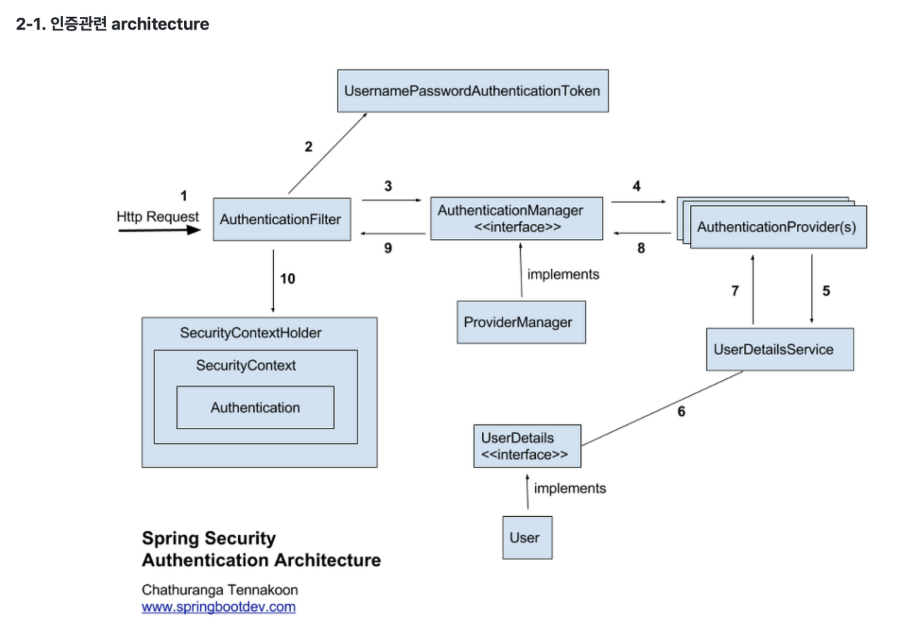
        </br>

        - **AuthenticationFilter**</br>
            들어오는 HTTP 요청을 중간에서 가로채고 인증 정보가 있는지 확인</br>
            `UsernamePasswordAuthenticationToken`을 생성해서 `AuthenticationManager`에게 인증을 위임

        - **UsernamePasswordAuthenticationToken**</br>
            인증 요청을 담는 그릇</br>
            인증 전, `아이디`와 `비밀번호`만 들고있다.</br>
            인증 후, 인증된 사용자 정보(`UserDetails`) + 권한 목록(`Authorities`)를 담는다.</br>
            > *"이런 정보로 로그인하고 싶어요" → "이 사람은 이런 권한이 있어요"*</br>

        - **AuthenticationManager**</br>
            인증 요청을 받아서 진짜 인증을 시도하는 최상위 인터페이스</br>

        - **ProviderManager**</br>
            `AuthenticationManager`의 구현체</br>
            여러개의 `AuthenticationProvider` 중에서 요청을 처리할 친구를 찾는다.</br>

        - **AuthenticationProvider**</br>
            실제 인증 로직이 들어가는 계층</br>
            성공하면 인증된 Authentication 객체를 새로 만들어 반환</br>
          

        - **UserDetailsService**</br>
            username으로 사용자 정보를 읽어오는 서비스</br>
            
            ```java
            public interface UserDetailsService {

                /**
                * username(사용자명)을 전달받아 해당 사용자의 정보를 조회하고,
                * 그 결과를 UserDetails 타입으로 반환한다.
                * @param username 로그인 시 입력된 사용자 아이디
                * @return UserDetails 스프링 시큐리티가 이해할 수 있는 사용자 정보 객체
                * @throws UsernameNotFoundException 해당 username을 가진 사용자가 존재하지 않을 경우 발생
                * GrantedAuthority
                */
                UserDetails loadUserByUsername(String username) throws UsernameNotFoundException;

            }
            ```

        - **UserDetails**</br>
            Security가 이해할 수 있는 사용자 정보의 표준 형태</br>
            도메인 `User(Entity)`를 `UserDetails` 구현체로 감싸서 반환</br>

            ```java
            public interface UserDetails extends Serializable {

                Collection<? extends GrantedAuthority> getAuthorities();    // 사용자가 가진 권한(ROLE_USER, ROLE_ADMIN 등)을 반환

                String getPassword();   // 사용자의 비밀번호를 반환

                String getUsername();   // 사용자의 아이디(주로 username, email 등)를 반환

                boolean isAccountNonExpired();  // 계정이 만료되지 않았는지를 반환 (true면 만료되지 않음)

                boolean isAccountNonLocked();   // 계정이 잠겨있지 않은지를 반환 (true면 잠기지 않음)

                boolean isCredentialsNonExpired();  // 비밀번호가 만료되지 않았는지를 반환 (true면 사용 가능)

                boolean isEnabled();    // 계정이 활성화되어 있는지를 반환 (true면 로그인 가능)

            }
            ```


        </br>
        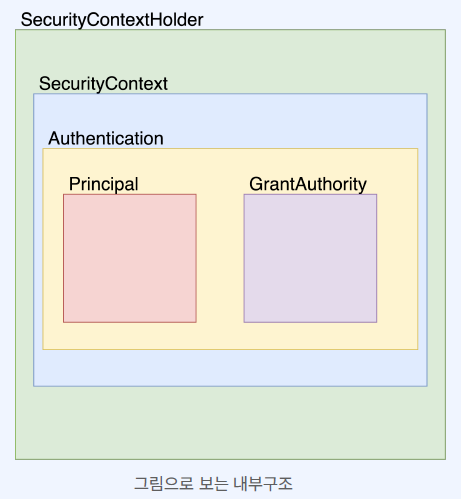

        - **SecurityContextHolder**</br>
            SecurityContext를 제공하는 static 메소드(getContext)를 지원한다.</br>

        - **SecurityContext**</br>
            접근 주체와 인증에 대한 정보를 담고 있는 Context이다.</br>
            즉, Authentication을 담고 있다.</br>

        - **Authentication**</br>
            Principal과 GrantedAuthority를 제공한다.</br>
            인증이 이루어지면 해당 Athentication이 SecurityContext에 저장된다.</br>
            즉, Security의 세션들은 내부 메모리(SecurityContextHolder)에 쌓고 꺼내쓰는 방식.</br>

        - **Principal**</br>
            유저에 해당하는 정보</br>
            대부분의 경우 Principal로 UserDetails를 반환한다.</br>

        - **GrantedAuthority**</br>
            ROLE_ADMIN, ROLE_USER 등 Principal이 가지고 있는 권한을 나타낸다.</br>

    ---

    3. **Spring Security의 동작 과정**
        1. **클라이언트 요청**
            - 사용자가 로그인 요청 시 HTTP Request 발생
        
        2. **AuthenticationFilter**
            - 요청을 가로채서 username, password를 추출
            - `UsernamePasswordAuthenticationToken(인증 전 상태)` 생성
            - 이를 AuthenticationManager에게 전달
        
        3. **AuthenticationManager**
            - AuthenticationManager는 인테페이스이며, 대부분의 구현체는 ProviderManager이다.
            - ProviderManager가 내부에 등록된 여러 AuthenticationProvider 중 하나에게 위임하여 수행
            - 예: `DaoAuthenticationProvider`

            > - **DaoAuthenticationProvider란?** </br>
            >   `UserDetailsService`와 `PasswordEncoder`를 사용하는 AuthenticationProvider의 구현체이다. </br>
            >   사실상 SecurityConfig 설정하고, UserDetails, UserDetailsService만 구현하면 되기 때문에 Spring Security를 구현하는 가장 일반적인 방식이다. </br>

            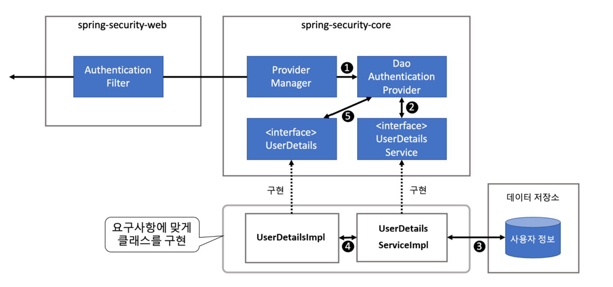
        
        4. **AuthenticationProvider**
            - `UserDetailsService.loadUserByUsername()` 호출
            - 해당 username의 사용자를 조회 및 UserDetails 반환
            - 비밀번호 비교
            - 성공 시 인증된 `Authentication` 객체 생성 및 반환

            ```java
            // 인증 후 상태의 Authentication 객체 생성
            return new UsernamePasswordAuthenticationToken(
                userDetails,    // principal (UserDetails)
                null,           // credentials (보안상 null 처리 → 비밀번호는 더 이상 필요 없고, 메모리에 남으면 위험하기 때문)
                userDetails.getAuthorities()    // 사용자 권한 목록
            )
            ```
        
        5. **Authentication 성공 처리**
            - AuthenticationFilter가 받은 인증된 객체를 `SecurityContextHolder`에 저장
            - SecurityContextHolder는 기본적으로 `ThreadLocal` 기반으로 작동하기 때문에 요청마다 독립된 SecurityContext가 유지된다.
            - 이후 요청에서는 SecurityContext에서 현재 사용자 정보 접근 가능

        6. **SecurityContextHolder**
            - 컨트롤러나 서비스 계층에서 Authentication을 꺼내 현재 사용자 정보 사용 가능

---
### 🍀 Jwt란 무엇이며, 어떤 역할을 하나요?

1. **Jwt란 무엇인가요?**

    > JSON WEB TOKEN의 약자로 속성 정보(Claim)를 JSON 데이터 구조로 표현한 토큰 </br>
    > 네트워크를 통해서 서로 다른 시스템 간 안전하게 전송하기 위해 설계됨 </br>

    1. **쿠키, 세션, 토큰 각각의 인증 방식은 무엇이고 각각 어떤 차이가 있을까요?**

        - **Cookie 인증**
            - 쿠키는 `Key-Value` 형식의 문자열 덩어리이다.
            - 클라이언트가 어떤 웹사이트를 방문할 경우, 그 사이트가 사용하고 있는 서버를 통해 클라이언트의 브라우저에 설치되는 작은 기록 정보 파일이다.
            
            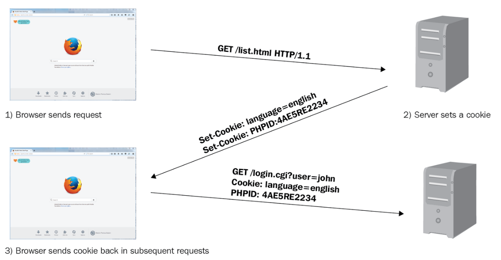

                1. 클라이언트가 서버에 접속 요청을 보낸다.
                2. 서버는 클라이언트의 요청에 대한 응답을 생성할 때, 클라이언트 측에 저장하고 싶은 정보를 응답 헤더의 Set-Cookie에 담는다.
                3. 이후 클라이언트는 요청을 보낼 때마다, 매번 저장된 쿠키를 요청 헤더의 Cookie에 담아 보낸다.
                4. 서버는 Cookie에 담긴 정보를 바탕으로 해당 요청의 클라이언트를 식별한다.

            - **단점**
                - 요청 시 쿠키의 값을 그대로 보내기 때문에 유출 및 조작 당할 위험이 존재한다.
                - 용량 제한이 있어 많은 정보를 담을 수 없다.
                - 웹 브라우저마다 쿠키에 대한 지원 형태가 다르기 때문에 브라우저간 공유가 불가능하다.
                - 쿠키의 사이즈가 커질수록 네트워크에 부하가 심해진다.


        - **Session 인증**
            - 클라이언트의 민감한 인증 정보를 서버 측에 저장하고 관리한다.
            - Session 객체는 Key에 해당하는 Session ID와 이에 대응하는 Value로 구성되었다.
            - Session ID 자체는 유의미한 개인정보를 담고 있지 않는다.

            

                1. 클라이언트가 웹사이트에 로그인하면 세션이 서버 메모리 상에 저장된다.
                2. 서버에서 브라우저에 쿠키에 Session ID를 저장한다.
                3. 쿠키에 정보가 담겨있기 때문에 브라우저는 해당 사이트에 대한 모든 Request에 Session ID를 쿠키에 담아 전송한다.
                4. 서버는 클라이언트가 보낸 Session ID와 서버 메모리로 관리하고 있는 Session ID를 비교하여 인증을 수행한다.
                
            - **단점**
                - Session ID 자체를 탈취하여 클라이언트인척 위장할 수 있다.
                - 서버에서 세션 저장소를 사용하므로 요청이 많아지면 서버에 부하가 심해진다.


        - **Token 인증**
            - 인증 정보를 Token 형태로 클라이언트 측에 저장한다.
            - 요청 헤더에 Token을 함께 보내 인증받은 사용자인지 확인한다.
            - 토큰 자체에 데이터가 들어있기 때문에 서버는 위조되었는지 판별만 한다.

            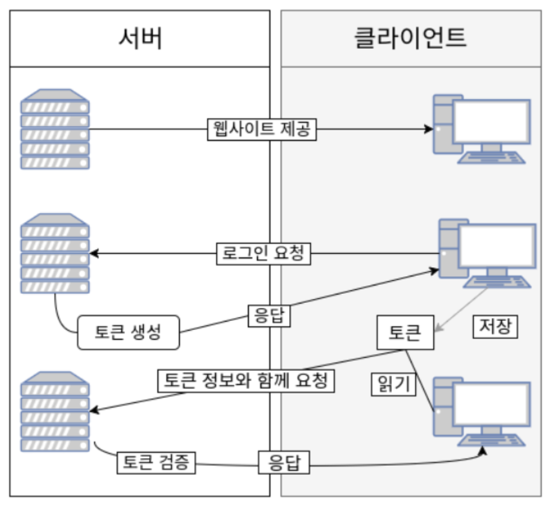

                1. 클라이언트가 웹사이트에 로그인한다.
                2. 서버는 클라이언트에게 유일한 Token을 발급한다.
                3. 클라리언트는 서버에게 받은 Token을 Cookie나 스토리지에 저장하고, 인증이 필요한 요청 헤더에 Token을 담아서 보낸다.
                4. 서버는 전달받은 Token을 검증하고 요청에 응답한다.

            - **단점**
                - Token 자체의 데이터 길이가 길어, 인증 요청이 많아질수록 네트워크 부하가 심해진다.
                - Payload 자체는 암호화되지 않기 때문에 유저의 중요한 정보는 담을 수 없다.

    ---
    2. **Jwt는 어떤 구조로 이루어져 있나요?**
        1. **헤더(header)**
            - 해시 암호화 알고리즘 + 토큰의 타입으로 구성
            - `HS256`, `RSA256`과 같은 서명 생성에 사용된 해시 알고리즘
            - 토큰의 타입(`JWT`)

        2. **페이로드(payload)**
            - `Payload`에 담는 정보의 한 조각을 `Claim`이라고 하며 `name / value`의 한 쌍으로 이루어진다.
            - 토큰에는 여러 개의 Claim을 넣을 수 있다.

            - **Registered Claim**
                - 토큰 정보를 표현하기 위해 이미 정해진 종류의 데이터들, 선택적으로 작성이 가능하다.

                    - `iss`: 토큰 발급자(issuer)
                    - `sub`: 토큰 제목(subject)
                    - `aud`: 토큰 대상자(audience)
                    - `exp`: 토큰 만료 시간(expiration)
                    - `nbf`: 토큰 활성 날짜(not before)
                    - `iat`: 토큰 발급 시간(issued at)
                    - `jti`: JWT 토큰 식별자(JWT ID)

            - **Public Claim**
                - 사용자 정의 Claim
                - 공개용 정보를 위해 사용된다.
                - Claim 이름 충돌을 방지하기 위해 URI 형식으로 이름을 지정한다.
            
            - **Private Claim**
                - 사용자 정의 Claim
                - 서버와 클라이언트 사이에 임의로 지정한 정보를 저장</br>

            > Registered: 표준, 시스템 정보 </br>
            > Public: 공개용 사용자 정보 </br>
            > Private: 서버-클라이언트 간 비공개 정보 </br>

        3. **서명(signature)**
            - `Header`, `Payload`, `Secret Key`를 합쳐서 암호화한다.

            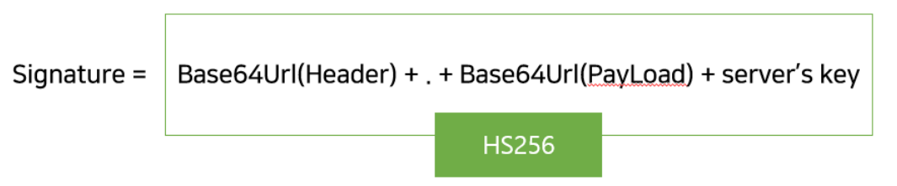


        - **JWT 발급 과정**

        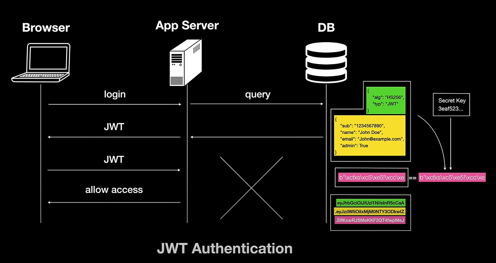

        1. 클라이언트가 로그인 요청
        2. 서버는 secret key와 payload를 서명 알고리즘에 입력하여 signature을 만들고 이를 조립한 JWT를 생성
        3. 클라이언트에게 JWT 반환
        4. 클라이언트는 인증이 필요한 요청을 보낼 때, 인증 헤더에 토큰을 담아서 요청
        5. 서버는 JWT Signature를 확인하고 payload로부터 사용자 정보를 확인해 비즈니스 로직 실행


    ---
    3. **Jwt의 장점과 단점은 각각 무엇일까요?**
        - **장점**
            1. Header와 Payload를 가지고 Signature를 생성하므로 데이터 위변조를 막을 수 있다.
            2. 인증 정보에 대한 별도의 저장소가 필요없다.
            3. Session과 다르게 서버는 Stateless 상태가 되어 서버 확장성이 우수해질 수 있다.
            4. Token 기반으로 다른 로그인 시스템에 접근 및 권한 공유가 가능하다.

        - **단점**
            1. Token 자체에 정보를 담고 있으므로 유출 및 조작 당할 위험이 존재한다.
            2. 포함된 Claim이 많아질수록 Token의 크기가 커지고, 네트워크 부하가 증가할 수 있다.
            3. Payload 자체는 BASE64로 인코딩 된 것이기 때문에, 탈취당하여 디코딩 시 데이터를 볼 수 있다.
            4. 클라이언트 측에서 Token을 관리하고 저장하기 때문에 탈취당하면 대처하기가 어렵다. 

---
2. **Spring에서 Jwt를 어떻게 활용할 수 있을까요?**
    1. **AccessToken과 RefreshToken은 각각 무엇일까요?**
        - **Access Token**:</br>
            인증 및 인가를 위해 사용되는 토큰</br>
            서버에 별도로 저장되지 않고 토큰 자체를 검증하여 인증을 수행한다.</br>
        
        - **Refresh Token**:</br>
            새로운 Access Token을 재발급하기 위해 사용되는 토큰
            서버에 저장하여 토큰 일치성 검증 및 재발급 관리를 수행한다.</br>

        > Access Token은 접근에 관여하는 토큰, Refresh Token은 재발급에 관여하는 토큰

        Access Token을 발급된 이후, 서버에 저장되지 않고 토큰 자체로 검증을 하며 사용자의 권한을 인증한다.</br>
        탈취 시, 토큰이 만료되기 전까지 토큰을 가진 사람은 누구나 접근이 가능해진다.</br>
        따라서 토큰에 유효시간을 부여하여 탈취 문제에 대응한다.</br>
        하지만 보안성을 높이기 위해 유효기간을 짧게 할수록 사용자는 자주 로그인을 해야하는 불편함이 증가한다.</br>
        이 문제를 해결하기 위해 도입된 것이 Refresh Token이다.</br>

        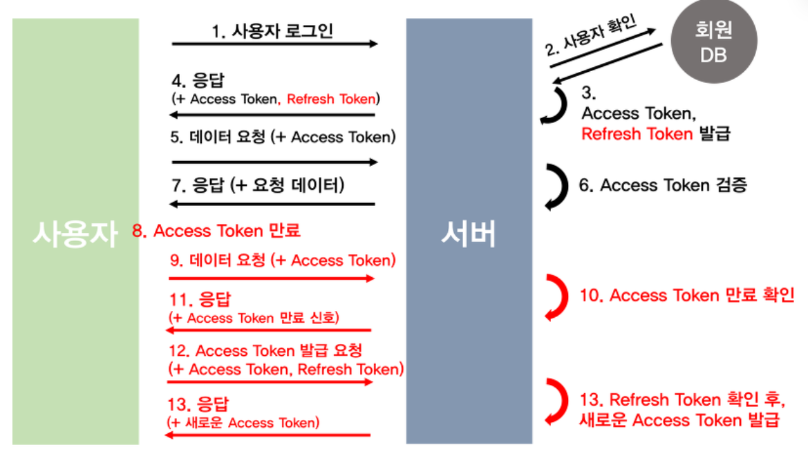

        - **재발급 과정**
            1. 첫 로그인
                - Access Token과 Refresh Token을 발급한다.
                - Refresh Token만 서버측의 DB에 저장한다.
                - 클라이언트는 Refresh Token과 Access Token을 쿠키 혹은 웹스토리지에 저장한다.

            2. 인증이 필요한 API에 접근
                - Access Token과 Refresh Token 둘 다 만료 → 에러 발생(재로그인 필요)
                - Access Token 만료, Refresh Token 유효 → Refresh Token을 검증하여 Access Token 재발급
                - Access Token 유효, Refresh Token 만료 → Access Token 을 검증하여 Refresh Token 재발급
                - Access Token과 Refresh Token 둘 다 유효 → 정상 처리

                > - Refresh Token을 검증하여 Access Token 재발급 </br>
                >       클라이언트 측에 저장되어 있는 Refresh Token과 서버 DB에 저장되어 있는 Refresh Token의 일치성을 확인 후, Access Token 재발급</br>
                >       불일치 시, 토큰 위조로 판단하여 로그인 재요청</br>
                > - Access Token 을 검증하여 Refresh Token 재발급</br>
                >       Access Token이 이미 인증된 것과 마찬가지니 바로 Refresh Token 재발급</br>
            
   ---
    2. **각 토큰은 클라이언트와 서버에서 어떤 방식으로 관리되어야 할까요?**

    | 구분                | 클라이언트 측 관리                       | 서버 측 관리                           |
    | ----------------- | -------------------------------- | --------------------------------- |
    | **Access Token**  | 쿠키 or 로컬 스토리지에 저장, 매 요청 시 헤더에 포함 | 별도 저장 없음, 서명 검증만 수행               |
    | **Refresh Token** | 쿠키 or 스토리지에 저장                   | DB/Redis 등 안전한 저장소에 저장 후 검증용으로 사용 |


---
### 🍀 CORS란 무엇인가요?

> **Cross-Origin Resource Sharing(다른 출처 리소스 공유 정책)**

기본적으로 모든 요청은 서로 다른 도메인에 대한 요청을 보안상 제한한다. (Same-Origin 정책)</br>
그러나, 다른 도메인 서버에 있는 자원을 자주 가져다 쓰거나 제공하는 경우가 많다.</br>
이때 사용하는 정책이 Cross-Origin 정책이다.</br>

1. **Origin이 무엇인가요?**

    Origin = 출처

    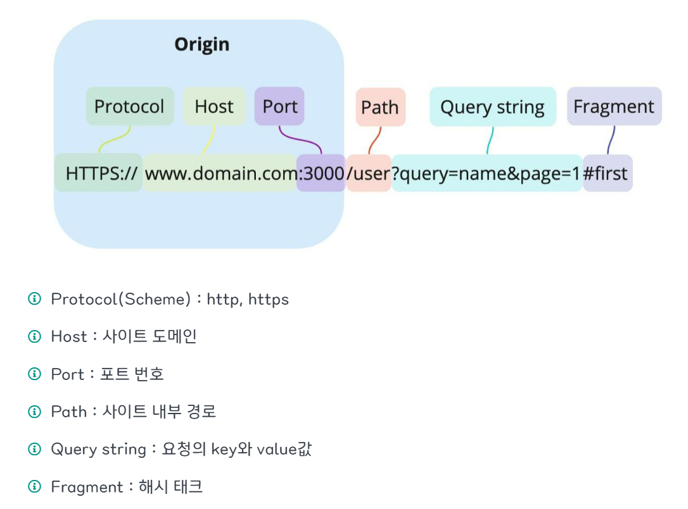

---
2. **SOP 정책이란 무엇인가요?**
    - **Same-Origin Policy**
    - "동일한 출처에서만 리소스를 공유할 수 있다."
    - 다른 출처 간 소통이 자유롭고 제약이 없다면, CSRF(Cross-Site Request Forgery)나 XSS(Cross-Site Scripting) 공격을 통해서 민감한 데이터가 유출될 수 있다.

    - **Cross-Origin Resource Sharing**
    - "다른 출처의 리소스 공유에 대한 허용/비허용 정책"
    - SOP 정책을 위반해도 CORS 정책에 따르면 다른 출처의 리소스라도 허용한다.
    
    - 가게를 생성하기 위해 로컬에서 개발한 API의 URL이 "http://localhost:8080/api/stores"라고 할 때, 외부에서는 localhost:8080으로 진입하지 못한다.
    - 따라서 AWS나 외부 서버에 배포를 해서 접근을 해야한다.
    - 이때 SOP 정책이 기본으로 적용되어있기 때문에 서버 측에서는 공유할 Origin을 설정해야 외부에서 해당 API에 접근할 수 있다. 

        ```java
        configuration.setAllowedOrigins(List.of("http://localhost:5173", "https://dongmin.inuappcenter.kr"));
        ``` 
    
    - Origin 비교와 차단은 서버가 아닌 브라우저가 한다.
    
    - 브라우저의 CORS 기본 동작   
        1. 클라이언트에서 HTTP 요청 헤더에 Origin을 담아 전달한다.
        2. 서버는 Access-Control-Allow-Origin 헤더에 접근이 혀용된 Origin을 담아 클라이언트에게 전달한다.
        3. 브라우저는 (1)에서의 Origin과 (2)에서의 Access-Control-Allow-Origin을 비교하여 차단 여부를 결정한다.
    
    - 결론은 서버에서 Access-Control-Allow-Origin 헤더에 허용할 Origin을 설정하면 된다.

---
3. **Spring에서 CORS를 어떤 방식으로 관리해야 할까요?**
    - CORS 작동 방식
        1. 예비 요청(Preflight Request)
            - 본 요청을 보내기 전에 브라우저 스스로 안전한 요청인지 미리 확인하는 작업이다.
            - `OPTIONS` 요청 메서드를 사용한다.

            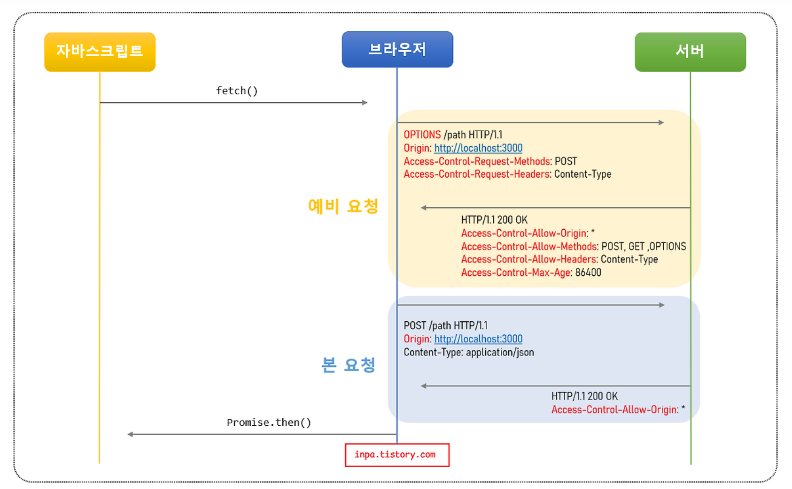

                1. 자바스크립트의 fetch() 메서드를 통해 리소스를 받아오려고 한다.

                2. 브라우저는 서버로 HTTP OPTIONS 메서드로 예비 요청을 보낸다.
                    1. Origin 헤더에 자신의 출저를 기입한다.
                    2. Access-Control-Request-Method 헤더에 실제 요청에 사용할 메소드를 설정한다.
                    3. Access-Control-Request-Headers 헤더에 실제 요청에 사용할 헤더들을 설정한다.

                3. 서버는 CORS 정책을 응답 헤더에 담아 브라우저에게 보낸다.
                    1. Access-Control-Allow-Origin 헤더에 허용되는 Origin들의 목록을 설정한다.
                    2. Access-Control-Allow-Methods 헤더에 허용되는 메소드들의 목록을 설정한다.
                    3. Access-Control-Allow-Headers 헤더에 허용되는 헤더들의 목록을 설정한다.
                    4. Access-Control-Max-Age 헤더에 해당 예비 요청이 브라우저에 캐시 될 수 있는 시간을 초 단위로 설정한다.

                4. 브라우저는 보낸 요청과 서버가 응답해준 정책을 비교하여, 해당 요청이 안전한지 확인하고 본 요청을 보낸다.

        2. 단순 요청(Simple Request)

            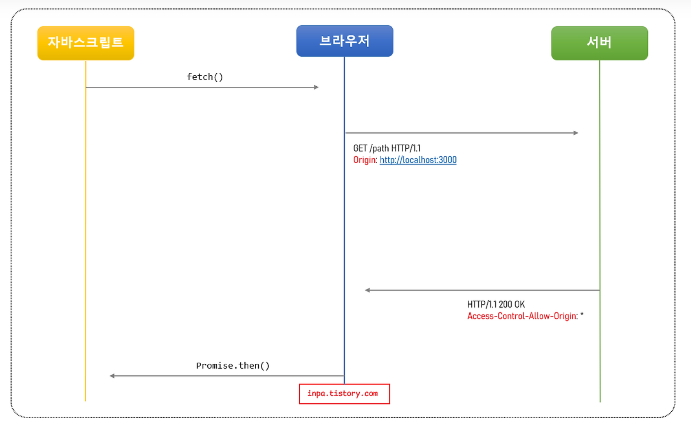

                다음 3가지를 만족해야 예비 요청을 생략할 수 있다.

                1. 요청 메서드는 GET, HEAD, POST 중 하나여야 한다.

                2. Accept, Accept-Language, Content-Language, Content-Type, DPR, Downlink, Save-Data, Viewport-Width, Width 헤더일 경우 에만 적용된다.

                3. Content-Type 헤더가 application/x-www-form-urlencoded, multipart/form-data, text/plain중 하나여야한다.

                하지만 대부분의 HTTP API 요청은 application/json 형태로 전송되기 때문에 3번째 조건에 해당하지 않아, Preflight Request가 발생한다.

        3. 인증된 요청(Credentialed Request)
            - 클라이언트가 민감한 정보를 포함한 요청을 보낸 때 발생한다.
            - 브라우저는 보안을 위해 기본적으로 CORS 요청에 자격 증명을 포함하지 않는다.
            - 이때, 클라이언트와 서버 모두 명시적으로 자격 증명을 허용해야 인증된 요청이 가능하다.

            ```javascript
            // 클라이언트 측 설정
            fetch("https://dongmin.inuappcenter.kr/api/stores", {
                method: "POST",
                credentials: "include", // 모든 요청에 인증 정보를 담는다
            });
            ```

            ```java
            // 서버 측 설정
            http.cors(cors -> cors.configurationSource(request -> {
                CorsConfiguration config = new CorsConfiguration();
                config.addAllowedOrigin("https://dongmin.inuappcenter.kr");
                config.addAllowedMethod("*");
                config.addAllowedHeader("*");
                config.setAllowCredentials(true);
                return config;
            }));
            ```

            - 인증된 요청에 대해 일반적인 CORS 요청과는 다르게 대응해줘야 한다.
            
                1. Access-Control-Allow-Credentials 항목으로 true로 설정한다.
                2. Access-Control-Allow-Origin은 *(와일드카드)을 사용할 수 없다.
                3. Access-Control-Allow-Methods, Access-Control-Allow-Headers는 *(와일드카드)을 사용할 수 있다/


    - **Spring에서 CORS를 설정하는 법**

        ```java
        @Bean
        public SecurityFilterChain filterChain(HttpSecurity http) throws Exception {
            http
                // JWT 인증 및 필터 설정
                .authorizeHttpRequests(auth -> auth
                    .requestMatchers("/api/auth/**", "/swagger-ui/**", "/v3/api-docs/**").permitAll()
                    .anyRequest().authenticated()
                )
                .sessionManagement(session -> session
                    .sessionCreationPolicy(SessionCreationPolicy.STATELESS)
                )
                .csrf(AbstractHttpConfigurer::disable)
                .cors(cors -> cors.configurationSource(corsConfigurationSource()));

            return http.build();
        }

        @Bean
        public CorsConfigurationSource corsConfigurationSource() {
            CorsConfiguration config = new CorsConfiguration();
            config.setAllowedOrigins(List.of("http://localhost:5173", "https://dongmin.inuappcenter.kr"));
            config.setAllowedMethods(List.of("GET", "POST", "PUT", "DELETE", "OPTIONS"));
            config.setAllowedHeaders(List.of("*"));
            config.setExposedHeaders(List.of("Authorization", "Set-Cookie"));
            config.setAllowCredentials(true);
            config.setMaxAge(3600L);

            UrlBasedCorsConfigurationSource source = new UrlBasedCorsConfigurationSource();
            source.registerCorsConfiguration("/**", config);
            return source;
        }
        ```
---