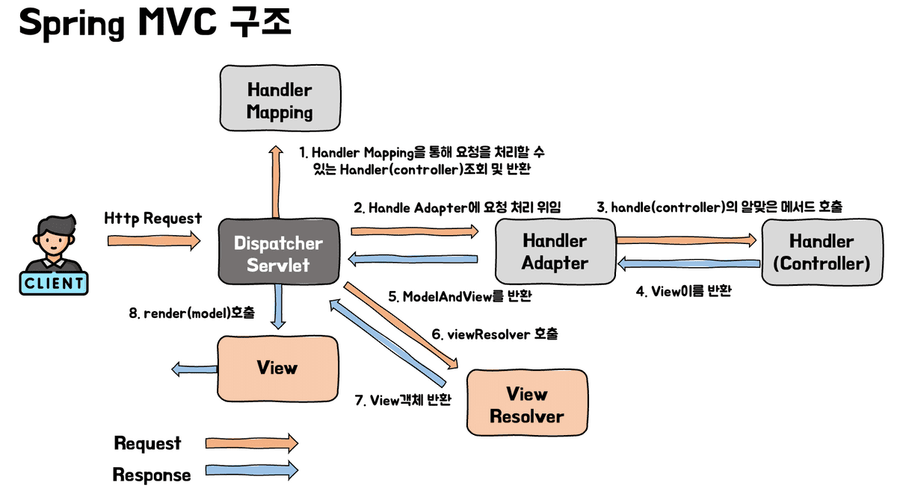
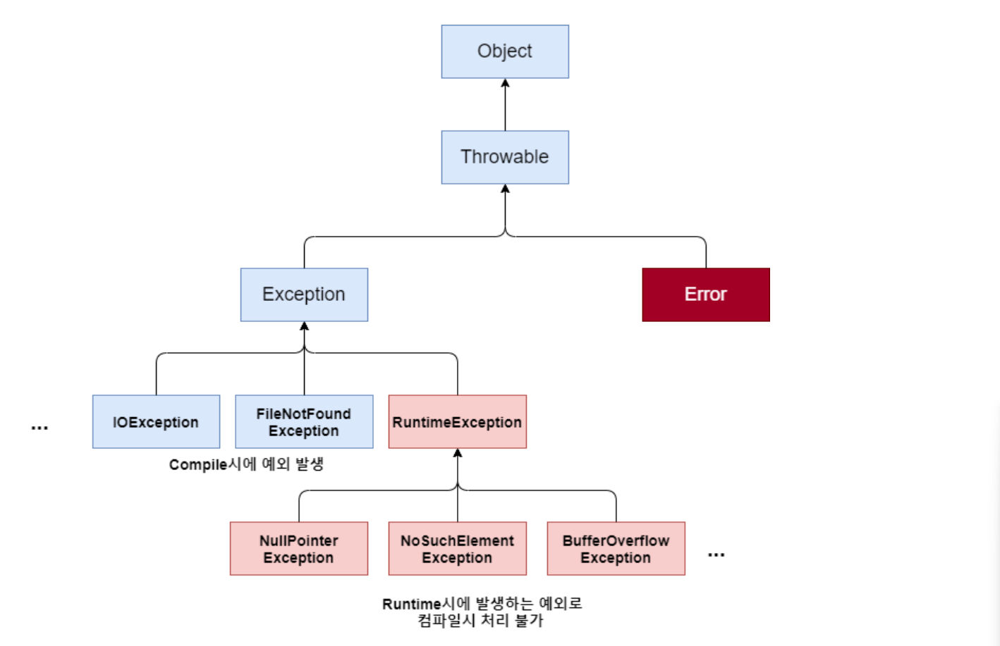

# 🍀 유효성 검사는 무엇이고 Spring에서 어떻게 적용할 수 있나요?

## 1. **유효성 검사란?**

### 1. **유효성 검사의 의미와 이유는 무엇인가요?**
- **유효성 검사(Validation)**란, 클라이언트가 보낸 요청 데이터(`Request DTO`)가 **서버가 의도한 형식·조건·범위를 충족하는지 검증하는 과정**이다.  
- 예를 들어, 서버에서 `UserRequestDto`를 통해 `User` 엔티티를 생성할 때, </br>
이메일 필드는 반드시 **`@`와 `.com`을 포함하는 형식**이어야 한다고 가정하자.</br>
유효성 검사가 없다면 `"abc"`와 같은 잘못된 값도 그대로 엔티티에 저장될 수 있다.  
- 즉, 유효성 검사는 **데이터의 입력(Input), 변환(Transformation), 처리(Process)** 전 과정에서  
데이터가 **예상된 형식과 제약 조건을 만족하는지** 확인하여 시스템의 신뢰성과 안전성을 보장하는 절차이다.

### 2. **유효성 검사를 해야 하는 이유는 무엇일까요?**
1. 보안 및 데이터 무결성 강화
    - 외부에서 전송된 데이터는 언제든 **위·변조될 위험**이 있으므로, 서버 측에서 최종 검증을 수행해야 한다.  
    - 유효성 검사를 통해 **잘못된 데이터가 DB에 저장되거나 내부 로직을 오염시키는 것을 방지**할 수 있다.

2. 개발 효율성 증진
    - 유효하지 않은 입력을 조기에 감지함으로써, **실시간 피드백을 제공하고 디버깅 비용을 줄일 수 있다.**  

3. API 명세 준수
    - 데이터가 명세된 형식을 벗어나면 **파싱, 형변환, 비즈니스 로직 처리 중 예외**가 발생할 수 있다.  
    - API가 **예상 가능한 입력값만 처리하도록 보장**하여, 전체 시스템의 **일관성과 안정성**을 높인다.

## 2. **Spring에서의 유효성 검사는 어떻게 할까요?**

### 1. **어디에서 유효성 검사를 실시해야 할까요?**

주로 다음 두 계층에서 검증을 수행한다.

1. **Controller**
    - 클라이언트로부터 전달된 `Request DTO`를 검증하는 1차 방어선 역할.
    - 잘못된 요청은 비즈니스 로직에 들어가기 전에 차단된다.
    - `@Valid`, `BindingResult` 사용
        
2. **Service**
    - 비즈니스 로직 수행 전, 객체 간 변환이나 로직 수행 과정에서 유효성을 재확인한다.
    - Controller를 거치지 않는 내부 호출(예: 스케줄러, 다른 서비스 호출 등)에 대해 추가 방어가 가능하다.
    - `@Validated` 사용

### 2. **Bean Validation은 무엇이며 왜 등장하게 됐나요?**
- **Bean Validation**은 **어노테이션 기반으로 객체의 유효성을 쉽게 검증할 수 있도록 정의된 표준 API이다.
- 자체적으로 동작하지 않고, 실제 검증 로직은 **`Hibernate Validator`** 가 구현체로 제공한다.  

- build.gradle에 의존성 추가

```java
// Validation
implementation 'org.springframework.boot:spring-boot-starter-validation'
```

### 3. **@Valid와 @Validated 의 차이는 무엇인가요?**
- **@Valid**
    - Bean Validator를 통해 객체의 데이터 유효성 검증을 지시하는 어노테이션이다.
    - Client에서 요청이 들어오면 `Dispatcher Servlet`에서 요청에 맞는 Controller에 요청을 전달한다.
    - 이때, 전달 과정에서 컨트롤러 메서드의 객체를 전달해주는 `HandlerMethodArgumentResolver`가 동작한다.
    - @Valid 역시` HandlerMethodArgumentResolver`에 의해 처리 된다.
    - 따라서 @Valid는 주로 Controller에서 `request body`를 검증하는데 많이 사용된다.

- **@Validated**
    - Controller 뿐만 아니라 다른 계층에서도 유효성 검증을 해야하는 경우, 메서드 요청을 가로채서 유효성 검증을 해주는 `Spring AOP` 기반 기능이다.
    - 유효성 검증이 필요한 클래스에 @Validated를 붙이고, 유효성 검증을 할 파라미터에 @Valid를 붙여서 사용한다.
    - @Validated를 클래스에 선언하면 해당 클래스에 유효성 검증을 위한 인터셉터인 `MethodValidationInterceptor`가 등록된다.
    - 해당 클래스의 메서드가 호출 될 때 AOP가 포인트컷으로 확인하고 요청을 중간에 가로채서 유효성 검증을 진행한다.
    - @Validated는 Spring의 기능이기 때문에 Spring Bean이라면 모두 유효성 검증이 가능하다.

### 4. @Validated는 Controller에서 언제, 어떤 상황에 쓰일까요?

- 일반적으로 `@Valid`는 **Controller** 계층에서 요청 DTO를 검증할 때 사용된다.  
- 그러나 **그룹별 검증(Group Validation)** 이 필요하거나 **AOP 기반 검증 로직**을 함께 적용해야 하는 경우에는 `@Validated`를 사용하는 것이 더 적합하다.

> 즉, Controller에서는 단순 요청 검증은 `@Valid`,  
> 그룹 검증이나 계층 간 검증이 필요한 경우에는 `@Validated`를 사용하는 것이 권장된다.

### 5. 유효성 검사는 어느 시점에, 어떤 순서로 수행될까요?

#### 1. @Valid가 동작되는 시점은 어디일까요?
- `@Valid`가 붙은 **Controller 메서드의 매개변수**가 존재한다면,  
  Spring Boot는 내부적으로 **Hibernate Validator**를 실행하여 해당 객체의 필드를 검증한다.

 

- @Valid는 위의 과정 중에서 HandlerAdapter에서 Handler를 호출하는 과정(3번)에서 동작하게 된다.
- 즉, **요청 본문(JSON)** 을 DTO로 변환하는 과정에서 유효성 검증이 동시에 이루어진다.  
- 검증에 실패하면 `MethodArgumentNotValidException` 예외가 발생하며, Spring의 예외 처리기(`@ExceptionHandler`, `@ControllerAdvice`)를 통해 응답이 반환된다.

### 6. 유효성 검사를 위한 어노테이션은 어떤 것들이 있을까요? (@Email, @NotNull 등)

| **어노테이션**                    | **설명**                                           |
| --------------------------------- | ------------------------------------------------ |
| `@Null`                           | 값이 **반드시 null** 이어야 함을 검증                        |
| `@NotNull`                        | 값이 **null이 아니어야 함** (단, 비어 있는 문자열 `""`은 허용됨)     |
| `@NotEmpty`                       | 값이 **null도 아니고 비어 있지도 않아야 함** |
| `@NotBlank`                       | 문자열이 **null이 아니고, 공백이 아닌 문자**를 포함해야 함            |
| `@Email`                          | 이메일 주소 형식이 올바른지 검증 (`@` 포함 등)                    |
| `@Max(value)`                     | 값이 **지정한 최대값 이하**인지 검증                           |
| `@Min(value)`                     | 값이 **지정한 최소값 이상**인지 검증                           |
| `@Length(min, max)`               | 문자열 길이가 **min 이상, max 이하**인지 검증                  |
| `@Range(min, max)`                | 숫자값이 **min 이상, max 이하**인지 검증                     |
| `@URL(protocol, host, port)`      | 문자열이 **유효한 URL 형식**인지 검증                         |


### 7. 중첩 객체의 유효성 검사는 어떻게 할까요? (@Valid의 중첩 적용)
- DTO 내부에 또 다른 객체(중첩 DTO)가 포함되어 있다면,  
  해당 필드에도 **`@Valid`**를 명시해주어야 내부 필드까지 검증이 수행된다.

# 🍀 에러와 예외의 차이는 무엇일까요? Spring에서의 예외처리는 어떻게 진행할까요?

## 1. **예외 처리의 개념**
### 1. **에러와 예외의 차이는 무엇인가요?**
- *Error*
    - *Logic Error (논리 에러)*
        - 흔히 알고있는 **버그**에 해당한다.
        - 프로그램이 실행하고 작동하는데는 아무런 문제는 없다.
        - 하지만 결과가 예상과 달라 사용자가 의도한 작업을 수행하지 못하고 서비스 이용에 지장이 생길 수 있다.

    - *Compillation Error (컴파일 에러)*
        - 컴파일 단계에서 오류가 발견되면 컴파일러가 에러 메시지를 출력해준다.
        - 대부분 문법 구문 오류(syntax error)이다.
        - 프로그램 실행 자체가 불가능하기 때문에 수정해서 컴파일 시 큰 문제가 되지는 않는다.

    - *Runtime Error (런타임 에러)*
        - 프로그램 실행 중에 에러가 발생하는 경우다.
        - 개발 시 설계 미숙으로 발생하는 에러가 대부분이다.

- **Error vs Exception**

| 구분 | **Error** | **Exception** |
|------|------------|----------------|
| **정의** | 시스템 레벨에서 발생하는 치명적 오류 | 개발자가 처리 가능한 프로그램 오류 |
| **예시** | `OutOfMemoryError`, `StackOverflowError` | `NullPointerException`, `IOException` |
| **발생 위치** | JVM 내부 | 애플리케이션 코드 내 |

### 2. 예외 처리의 방법  (예외 복구, 예외 처리 회피, 예외 전환, 예외 전파)

| **처리 방법** | **설명** | **예시 코드** |
|----------------|-----------|----------------|
| **예외 복구 (Recovery)** | 예외 발생 시, 적절히 복구하여 정상 흐름으로 복귀 | `try-catch` 문으로 예외 처리 후 정상 흐름 유지 |
| **예외 회피 (Throwing)** | 자신이 처리하지 않고 상위 메서드로 던짐 (`throws`) | `public void read() throws IOException` |
| **예외 전환 (Translation)** | 구체적인 예외를 의미 있는 예외로 바꿔 던짐 | `throw new CustomException("파일 읽기 실패", e)` |
| **예외 전파 (Propagation)** | 예외가 상위 호출 스택으로 계속 전달 | `throw e` 를 명시하지 않아도 JVM으로 전달됨 |


### 3. 자바의 예외 클래스는? (Checked Exception / Unchecked Exception)
- Java에서 모든 예외는 **`Throwable`** 클래스를 상속한다. 
- Java에서 다루는 모든 예외 오류는 Exception 클래스에서 처리한다.
- **파랑색**: 컴파일 예외 클래스들(Checked Exception), **붉은색**: 런타임 예외 클래스들(Unchecked Exception)



|          | **Checked Exception** | **Unchecked Exception** |
|----------|-------------------|---------------------|
| `처리 여부` | 반드시 예외를 처리해야 함 | 명시적인 처리를 강제하지 않음 |
| `확인 시점` | 컴파일 단계| 런타임 단계 |
| `예외 종류` | RuntimeException을 제외한, Exception 클래스와 </br> 그를 상속받는 하위 예외 | RuntimeException과 그 하위 예외 |

- Checked Exception은 컴파일 단계에서 확인하기 때문에, 별도의 예외 처리를 하지 않는다면 컴파일 자체가 되지 않는다.
- 따라서 Checked Exception이 발생할 가능성이 있는 부분은 별도의 처리 과정이 있어야한다.

## 2. **Spring에서의 예외 처리**

### 1. @ControllerAdvice, @ExceptionHandler 은 무엇이며 또한 이들을 활용한 예외처리 방식은 무엇인가요?

- **@ControllerAdvice**
    - 여러 컨트롤러에서 발생하는 예외를 **전역적으로** 처리하기 위한 어노테이션이다.
    - 전역 예외 처리기 클래스에 붙이며, 내부에서 `@ExceptionHandler`와 함께 사용된다.

- **@ExceptionHandler**
    - 특정 예외가 발생했을 때, 해당 예외를 처리하는 메서드 단위 예외 처리 어노테이션이다.
    - `@Contoroller`와 `@RestController` 내부에서도 사용 가능하다
    - 컨트롤러 단위의 예외 처리를 수행하기 때문에 코드 중복이 많아질 수 있다.
    - `@ControllerAdvice`와 함께 사용하면 전역 처리가 가능하다.

```java
@Slf4j
@RestControllerAdvice
public class GlobalExceptionHandler {

    @ExceptionHandler(RestApiException.class)
    public ResponseEntity<ErrorResponse> handleRestApiException(RestApiException e) {
        ErrorCode errorCode = e.getErrorCode();
        log.error("RestApiException", e);
        return ResponseEntity
                .status(errorCode.getHttpStatus())
                .body(ErrorResponse.create(errorCode.getCode(), errorCode.getMessage()));
    }

    @ExceptionHandler(MethodArgumentNotValidException.class)
    public ResponseEntity<ErrorResponse> handleMethodArgumentNotValidException(MethodArgumentNotValidException e) {
        ErrorCode errorCode = CustomErrorCode.INVALID_REQUEST;
        log.error("MethodArgumentNotValidException", e);
        FieldError fieldError = e.getBindingResult().getFieldError();
        String message = (fieldError != null) ? fieldError.getDefaultMessage() : errorCode.getMessage();
        return ResponseEntity
                .status(errorCode.getHttpStatus())
                .body(ErrorResponse.create(errorCode.getCode(), message));
    }
}
```

### 2. ControllerAdvice와 RestControllerAdvice의 차이가 무엇인가요?

| 구분           | **@ControllerAdvice**              | **@RestControllerAdvice**        |
| ------------ | ---------------------------------- | -------------------------------- |
| **반환 방식**    | View(HTML) 혹은 ResponseEntity 모두 가능 | JSON 형태로 응답 (`@ResponseBody` 포함) |
| **기반 어노테이션** | `@Controller` + `@Advice`          | `@RestController` + `@Advice`    |
| **사용 목적**    | MVC 기반(화면 응답) 프로젝트                 | REST API 응답용 프로젝트                |
| **주요 사용 예시** | JSP/Thymeleaf 등 View 반환            | JSON 에러 응답(API 서버)               |

### 3. ControllerAdvice 내 우선 순위와 ExceptionHandler 내 우선 순위
1. ControllerAdvice 내 우선 순위
    - 여러 @ControllerAdvice 클래스가 존재할 경우, @Order 어노테이션을 통해 처리 우선순위를 지정할 수 있다.

    ```java
    @Order(1)
    @RestControllerAdvice("server.dongmin.api.controller") // 특정 패키지 지정
    public class SpecificPackageExceptionHandler {
        
        @ExceptionHandler(Exception.class)
        public ResponseEntity<String> handleException(Exception e) {
            log.error("SpecificPackageExceptionHandler", e);
            return ResponseEntity.status(500).body("API 컨트롤러에서 발생한 예외");
        }

    }

    @Order(2)
    @RestControllerAdvice
    public class GlobalExceptionHandler {
        
        @ExceptionHandler(Exception.class)
        public ResponseEntity<String> handleException(Exception e) {
            log.error("GlobalExceptionHandler", e);
            return ResponseEntity.status(500).body("전역 예외");
        }

    }
    ```

2. ExceptionHandler 내 우선 순위
    - 동일한 ControllerAdvice 내에서 여러 @ExceptionHandler가 있을 때는 하위 예외가 우선 순위를 가진다
    
    ```java
    @RestControllerAdvice
    public class ExceptionHandlerPriority {

        // 하위 예외인 IOException을 먼저 처리
        @ExceptionHandler(IOException.class)
        public ResponseEntity<String> handleIOException(IOException e) {
            log.error("IOException Handler", e);
            return ResponseEntity.status(500).body("IOException 발생");
        }

        // 상위 예외인 Exception은 하위 예외에서 처리되지 않은 경우에만 실행
        @ExceptionHandler(Exception.class)
        public ResponseEntity<String> handleGeneralException(Exception e) {
            log.error("General Exception Handler", e);
            return ResponseEntity.status(500).body("일반적인 예외 발생!");
        }

    }
    ```
