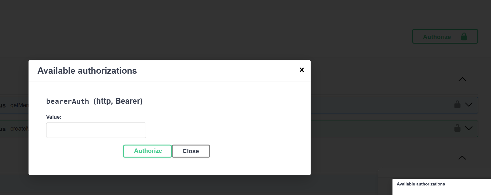
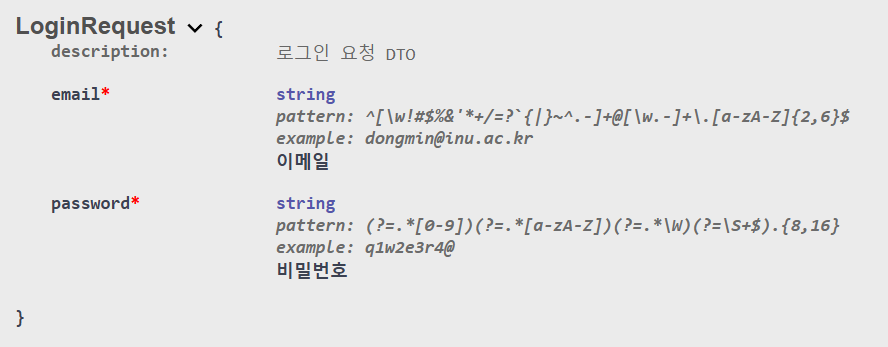
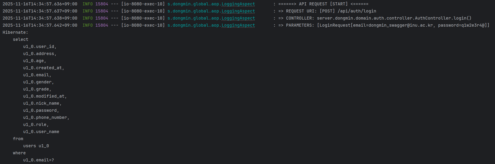
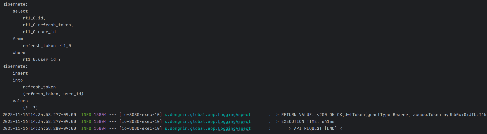
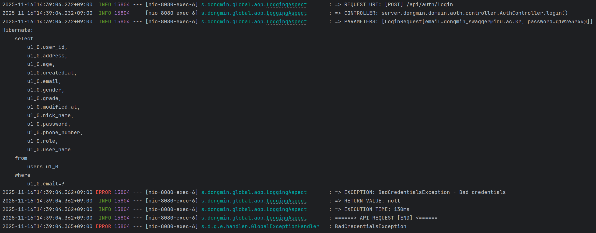

# 🍀 Logging은 무엇이며 Spring에서 어떻게 적용할 수 있을까요?

- 로깅(logging)은 소프트웨어 시스템에서 발생하는 모든 행위와 이벤트 정보를 시간 순서대로 기록하는 작업을 말한다.
- 프로그램의 실행 상태를 모니터링하고, 문제를 진단하며, 성능을 평가하는 데 필수적이다.
- 쉽게 말해, 로깅은 프로그램 실행 과정의 흔적을 남기는 것이다. 
- System.out.println()을 사용해 로그를 남기는 것도 로깅에 해당한다.

## Logging 전략은 무엇이고 왜 세워야 할까요?

1. **성능에 부하를 줄일 수 있다.**
    - `System.out.println()`은 리소스를 많이 사용한다.
    - println()의 경우, `newLine`이라는 메서드를 호출함으로써 출력이 수행된다.
    - `synchronized`는 한 임계영역에 대해 쓰레드를 하나씩 집입시켜 작업을 수행한다.
    - 트래픽이 많은 서비스에서 100만개의 쓰레드가 동시에 임계영역에 진입한다고 가정한다면, 병목현상으로 로그 조회가 밀리는 쓰레드가 발생한다.
    
    ```java
    private void newLine() {
        try {
            synchronized (this) {
                ensureOpen();
                textOut.newLine();
            // ...
            }
        }
    }
    ```

    - 반면, `Logger`는 내부 버퍼링과 멀티 쓰레드를 지원해주기 때문에 병목현상이 없으며, 상대적으로 성능이 좋다.
    - 또한 특정 요청이 처리되는 데 걸리는 시간을 로그에 기록하면, 성능 저하가 발생하는 부분을 쉽게 찾아낼 수 있다.


2. **상황에 맞는 상세한 정보를 받을 수 있다.**
    - `System.out.println()`은 직접 코드를 작성해 우리가 원하는 정보를 만들어야 한다는 매우 번거로운 단점이 있다.
    - 반면, `Logger`는 클래스의 이름, 시간, 레벨 등의 유의미한 정보만 제공해준다.
    - Slf4j와 같은 Logging 라이브러리를 활용하면 `TRACE`, `DEBUF`, `INFO`, `WARN`, `ERROR`, `FATAL` 과 같은 다양한 타입의 로깅 레벨을 알맞게 제공받을 수 있다.


## Log Level은 무엇이고 어떻게 적용해야 할까요?

| Level | Color| Specification |
|-------|------| ------------- |
| FATAL | RED | 시스템을 즉시 종료해야하는 심각한 오류 |
| ERROR | RED | 예상치 못한 문제가 발생했지만, 애플리케이션 실행은 계속할 수 있는 상황 |
| WARN | YELLOW | 잠재적인 위험이 있지만, 심각한 오류는 아닌 상황 |
| INFO | GREEN | 애플리케이션의 주요 실행 흐름을 보여주는 정보 |
| DEBUG | GREEN | 애플리케이션 디버깅에 필요한 상세 정보 |
| TRACE | GREEN | DEBUG보다 더 상세한 정보 |

## Spring에서 Logging을 적용하는 방법에는 어떤 것이 있나요?

- **로깅 라이브러리**
    1. **Logback**
        - Slf4j의 구현체로 Spring Boot 환경에서는 `spring-boot-starter-web`에 기본적으로 포함된 `spring-boot-starter-logging`을 통해 Logback을 사용할 수 있다.

    2. **Log4j2**
        - 최신 프레임워크로, Logback에 비해 **멀티 쓰레드 환경에서 비동기 처리가 빠르다.**
        - Log4j2를 사용하기 위해서는 해당 과정을 통해 Logback을 제거하고 Log4j2로 갈아끼운다.
            1. spring-boot-starter-logging 제거
            2. spring-boot-starter-log4j2 추가
            3. 설정 파일도 log4j2-spring.xml로 변경


    3. **Log4j**
        - 2015년 지원이 종료된 라이브러리

    4. **Slf4j**
        - 위의 라이브러리를 통합하여 인터페이스로 제공한다.


- **@Slf4j vs @Log4j2**

    | 어노테이션 | Logger 타입 |
    | ------ | ----------------------------- |
    | @Slf4j | SLF4J API (org.slf4j.Logger) |
    | @Log4j2 | Log4j2 API (org.apache.logging.log4j.Logger) |

    - @Slf4j는 어떤 구현체가 뒤에 있든 상관없이 SLF4J 인터페이스만 사용한다.
    - 따라서 Logback → Log4j2로 갈아탈 때도 설정만 바꾸면 된다.

- **코드 적용 예시**
```java
@Slf4j
@Component
@RequiredArgsConstructor
public class JwtExceptionFilter extends OncePerRequestFilter {

    private final ObjectMapper objectMapper;

    @Override
    protected void doFilterInternal(HttpServletRequest request, HttpServletResponse response, FilterChain filterChain)
            throws ServletException, IOException {

        response.setCharacterEncoding("UTF-8");
        try{
            filterChain.doFilter(request, response);
        }catch (RestApiException e){
            log.error("JwtExceptionFilter: JWT Exception occurred - {}", e.getMessage());
            setErrorResponse(response, (CustomErrorCode) e.getErrorCode());
        }
    }
}
```

# 🍀 Swagger는 무엇이며 어떻게 활용할 수 있을까요?

## Swagger는 무엇일까요?
- 스웨거(Swagger)는 API 개발 및 문서화를 위한 도구이다.
- **기능**
    1. API 문서 자동 생성
        - 개발자가 작성한 API 코드르 기반으로 자동으로 API 문서를 생성할 수 있다.
        - 엔드포인트, 매개변수, 응답 형식 등에 대한 세부 정보를 쉽게 확인할 수 있다.
    
    2. API 스펙 정의
        - OpenAPI Sepecification(OAS)을 사용하여 API 스펙을 정의한다.
        - API의 구조와 동작 방식에 대한 명세를 명확하게 정의할 수 있다.

    3. 클라이언트 코드 생성
        - 클라이언트 라이브러리를 자동으로 생성할 수 있다.
        - 개발자는 클라이언트에서 API를 호출하는 데 필요한 코드를 직접 작성할 필요 없이 자동으로 생성된 코드를 사용할 수 있다.

    4. API 버전 관리
        - 새로운 버전의 API를 추가하고 이전 버전과의 호환성을 유지하는 등의 작업을 쉽게 수행할 수 있다.

## Spring에 Swagger를 어떻게 적용할 수 있을까요?(with Authorization)

1. **build.gradle 의존성 추가**

```build.gradle
// Swagger
implementation 'org.springdoc:springdoc-openapi-starter-webmvc-ui:2.5.0'
```
2. **Swagger Config**

```java
@Configuration
public class SwaggerConfig {

    @Bean
    public OpenAPI openAPI() {
        SecurityScheme securityScheme = new SecurityScheme()
                .name("JWT Authorization")
                .type(SecurityScheme.Type.HTTP)
                .scheme("bearer")
                .bearerFormat("JWT");

        Server prodServer = new Server();
        prodServer.setUrl("https://dongmin.inuappcenter.kr");
        prodServer.description("Production Server");

        Server localServer = new Server();
        localServer.setUrl("http://localhost:8080");
        localServer.description("Local Development Server");

        return new OpenAPI()
                .addSecurityItem(new SecurityRequirement().addList("bearerAuth"))
                .components(new Components()
                        .addSecuritySchemes("bearerAuth", securityScheme))
                .info(apiInfo())
                .servers(List.of(prodServer, localServer));
    }

    private Info apiInfo() {
        return new Info()
                .title("17.5th Server Study - dongmin") // API의 제목
                .description("17.5기 서버 스터디 과제 코드") // API에 대한 설명
                .version("1.0.0"); // API의 버전
    }
}
```
- 우측에 Authroize 버튼이 생성되는데 이 버튼을 누르면 아래와 같은 창이 뜬다.
- 로그인 시 받은 access token을 넣으면, 자동으로 인증이 필요한 API를 요청할 때 userDetails도 함께 넣어서 요청한다.



3. **Controller Layer**

```java
@Tag(name = "AuthController", description = "로그인 및 회원가입 컨트롤러")
public interface AuthControllerSpecification {
    @Operation(summary = "signup", description = "회원가입 시 사용되는 API")
    @ApiResponses({
            @ApiResponse(responseCode = "201", description = "✅ 회원가입 성공"),
            @ApiResponse(responseCode = "400", description = "❌ 유효성 검사 실패",
                    content = @Content(mediaType = MediaType.APPLICATION_JSON_VALUE,
                            schema = @Schema(implementation = ErrorResponse.class))),
            @ApiResponse(responseCode = "409", description = "❌ 중복된 리소스",
                    content = @Content(mediaType = MediaType.APPLICATION_JSON_VALUE,
                            examples = {
                                    @ExampleObject(name = "이메일 중복", value = "{\"error\": \"409\", \"message\": \"이미 가입된 이메일 입니다.\"}"),
                                    @ExampleObject(name = "닉네임 중복", value = "{\"error\": \"409\", \"message\": \"이미 존재하는 별명 입니다.\"}"),
                                    @ExampleObject(name = "전화번호 중복", value = "{\"error\": \"409\", \"message\": \"이미 가입된 번호 입니다.\"}")
                            },
                            schema = @Schema(implementation = ErrorResponse.class)))
    })
    public ResponseEntity<Void> signup(@Valid @RequestBody SignUpRequest signUpRequest);
    
}
```

4. **DTO**

```java
@Schema(description = "로그인 요청 DTO")
public record LoginRequest(

        @Schema(description = "이메일", example = "dongmin@inu.ac.kr")
        @NotBlank(message = "이메일이 비어있습니다.")
        @Pattern(regexp = "^[\\w!#$%&'*+/=?`{|}~^.-]+@[\\w.-]+\\.[a-zA-Z]{2,6}$",
                message = "이메일 형식이 올바르지 않습니다.")
        String email,

        @Schema(description = "비밀번호", example = "q1w2e3r4@")
        @NotBlank(message = "비밀번호가 비어있습니다.")
        @Pattern(regexp = "(?=.*[0-9])(?=.*[a-zA-Z])(?=.*\\W)(?=\\S+$).{8,16}",
                message = "비밀번호는 8~16자 영문 대 소문자, 숫자, 특수문자를 사용하세요.")
        String password

) {
}
```

- Swagger에서 다음과 같이 DTO를 확인할 수 있다.




# 실습 프로젝트에 Logging과 Swagger 적용하기
→ API 별 로깅 적용하기(로그 캡쳐해오기)

- 로그인 요청 시 찍히는 로그





</br>
</br>

- 잘못된 패스워드 입력시 찍히는 로그




