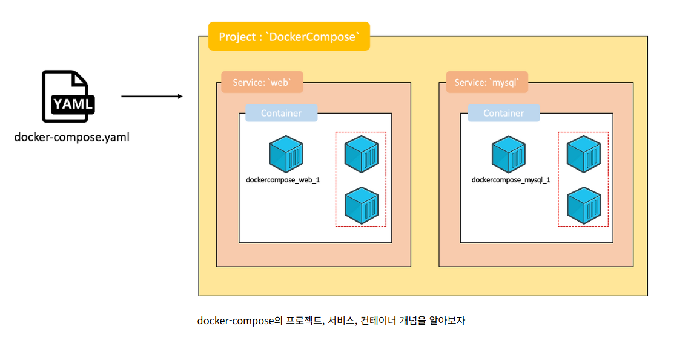

# 🍀 Docker란 무엇일까요?

## 컨테이너 기술은 무엇이고 왜 필요할까요?
컨테이너 기술은 애플리케이션과 라이브러리, 설정 등을 하나로 묶어 독립적으로 실행할 수 있게 하는 기술이다.
즉, 어디서 실행해도 똑같이 동작하는 환경을 만드는 것이 핵심이다.

### VM vs Container
- **VM(Virtual Machine)**
    - 하드웨어를 가상화하여 운영체제 전체를 올리는 방식
    - Host OS 위에 Hypervisor가 설치되어 여러 개의 OS를 동시에 실행 및 관리한다.
    - 운영체제 단위로 격리되어 보안성이 높다.
    - Guest OS까지 포함하므로 다소 무겁다.

- **Container**
    - Host OS의 커널을 공유하고, 필요한 실행 환경만 격리하여 사용하는 방식
    - 운영체제 전체가 아니라 필요한 환경만 패키징하기 때문에 VM에 비해 가볍다.

### Container를 사용하는 이유
1. **개발 환경과 서버 환경이 달라서 생기는 문제를 제거**
    - 로컬에서는 되는데 서버에서는 안되는 문제를 해결할 수 있다.
    - 모든 실행 환경이 이미지 안에 포함되어 있으므로, 서버는 이미지 그대로 실행만 하면 된다.

2. **설치 및 배포의 자동화**
    - 앱 실행에 필요한 환경을 이미지화 하고, 서버는 이미지만 받아서 실행된다.
    - 배포 자동화(CI/CD)에 매우 유리하다.

3. **높은 확장성**
    - 같은 이미지로 컨테이너를 복제하여 실행할 수 있다.
    - 컨테이너를 복제 하면 트래픽을 분산 시킬 수 있다.

4. **동일한 운영 환경**
    - 하나의 이미지를 기반으로 작동하기 때문에 어디서든 동일하게 실행된다.
    - 팀 협업에서도 모든 개발자가 같은 환경을 사용하게 된다.

## 도커란 무엇일까요?
1. 도커 이미지란 무엇이고 스프링 애플리케이션을 어떻게 이미지화할 수 있을까요?
    - **Docker Image**
        - 컨테이너를 생성하기 위한 일종의 설치 패키지를 말한다.
        - 애플리케이션을 실행하기 위한 필수 요소들이 포함된다.
            - Spring Boot JAR
            - JDK
            - 라이브러리
            - 환경 설정
            - 실행 명령어
    
    - **이미지화 방식**
        1. **애플리케이션 빌드 → JAR 파일 생성**
            ```bash
            ./gradlew build
            ```
            실행 후 /build/libs 폴더에 JAR 파일이 생성된다.

        2. **Dockerfile 생성**
            ```Dockerfile
            # base 이미지 설정(JDK 17)
            FROM openjdk:17
            LABEL version=0.1

            # jar 파일 이름과 경로를 변수로 설정
            ARG JAR_NAME=dongmin-0.0.1-SNAPSHOT.jar
            ARG JAR_PATH=./build/libs/${JAR_NAME}

            # 작업 디렉토리 설정
            RUN mkdir -p /app
            WORKDIR /app

            # JAR 파일을 컨테이너 내부로 복사
            COPY ${JAR_PATH} /app/app.jar

            # 컨테이너 실행 시 실행할 명령어
            CMD ["java", "-jar", "-Dspring.profiles.active=prod", "/app/app.jar"]
            ```

        3. Docker Image 빌드
            ```yaml
            run: docker build -t ${{secrets.DOCKER_HUB_USERNAME}}/baemin-server:latest .
            ```
2. 여러 대의 컨테이너를 어떻게 동시에 띄울 수 있을까요?

    여러 컨테이너를 동시에 실행하고 싶다면 Docker Compose를 사용한다.
    - **Docker Compose**
        - 여러 개의 컨테이너 서비스들을 하나의 yml 파일로 정의하고 `docker compose up` 한 번으로 전체 애플리케이션을 실행할 수 있게 도와주는 도구이다.
        - 웹 서비스를 개발하는 경우, 웹 페이지를 보여주는 웹 서버 역할 컨테이너와 웹 페이지의 데이터를 가지고 있는 MySQL 서버 컨테이너가 동시에 동작해야 한다.

    - **Compose가 필요한 이유**
        - 관리해야할 컨테이너가 많아질 수록 컨테이너를 일일이 실행시켜주고 테스트하는 것은 비효율적이다.
        - **docker-compose.yml** 파일에 여러 개의 컨테이너 옵션과 환경을 미리 정의하면 위 문제를 해결할 수 있다.
            - 실행 순서
            - 의존성
            - 네트워크
            - 볼륨
            - 환경 변수
            - 포트

            

        - **docker-compose.yml** 파일 세팅
            1. version
                - Docker Compose 파일의 버전을 지정

            2. services
                - 실행할 컨테이너를 정의

            3. container_name
                - 생성되는 컨테이너의 이름을 직접 지정

            4. image
                - 컨테이너를 생성할 때 사용할 Docker 이미지를 지정

            5. ports
                - 호스트와 컨테이너 간의 포트 매칭을 설정

            6. environment
                - 컨테이너 내부에서 사용할 환경 변수를 설정

            7. volumes
                - 컨테이너 데이터를 영구적으로 저장하는 경우 설정
                - 컨테이너를 삭제하더라도 DB 데이터를 남기고 싶을 때 사용

            8. networks
                - 여러 컨테이너 간 통신을 위한 가상 네트워크를 설정

            ```yaml
            version: "3.8"

            services:
            app:
                container_name: baemin-app
                image: dongmin/baemin-server:latest
                ports:
                - "8080:8080"
                environment:
                SPRING_DATASOURCE_URL: jdbc:mysql://db:3306/baemin
                SPRING_DATASOURCE_USERNAME: root
                SPRING_DATASOURCE_PASSWORD: root
                volumes:
                - app-logs:/app/logs
                networks:
                - baemin-network

            db:
                container_name: baemin-db
                image: mysql:8.0
                environment:
                MYSQL_ROOT_PASSWORD: root
                MYSQL_DATABASE: baemin
                volumes:
                - mysql-data:/var/lib/mysql
                networks:
                - baemin-network

            volumes:
            mysql-data:
            app-logs:

            networks:
            baemin-network:
            ```

# 🍀 CI/CD란 무엇일까요?

## CI/CD의 의미

1. **CI의 의미**
    - **CI(Continuous Integration)**: 지속적인 통합
    - 새로운 코드 변경 사항이 정기적으로 빌드 및 테스트되어 공유 Repository에 통합되는 것
    - 코드 충돌이나 오류를 조기에 발견하고 해결할 수 있다.

2. **CD의 두가지 의미**
    1. **Continuous Delivery**: 지속적인 (서비스) 제공
        - CI 이후 생성된 빌드 결과물을 테스트 서버까지 자동으로 배포하는 과정이다.
        - 운영 배포 직전 단계까지 모든 과정을 자동화한다. → 마지막에 개발자가 개입하여 마무리해야 함

    2. **Continuous Depolyment**: 지속적인 배포
        - 테스트까지 통과된 코드가 운영 서버까지 자동으로 배포되는 완전 자동화 과정이다.
        - 개발자의 개입 없이 실제 서비스에 반영된다

3. **CI/CD의 중요성**

    - **CI의 중요성**
        1. 코드 충복을 빠르게 발견할 수 있다.
        2. 모든 코드 변경이 자동으로 빌드 및 테스트되기 때문에 품질이 유지되고 버그를 조기에 제거할 수 있다.
        3. 팀원 간 협업 시 코드가 안정적으로 통합된다.

    - **CD의 중요성**
        1. 배포 과정이 자동화되므로 사람이 개입하여 발생하는 실수가 줄어든다.
        2. 운영 환경과 테스트 환경의 일관성을 유지할 수 있다.
        3. 배포 속도가 빨라져 사용자에게 기능을 더 빠르게 제공할 수 있다.

## 다양한 CI/CD 툴

1. **Jenkins**
    - 가장 널리 사용되는 오픈소스 CI/CD 자동화 도구이다.
    - 수천 개 이상의 플러그인을 제공하여 확장성이 매우 높다.
    - Java 기반으로 동작하며 별도의 서버(Jenkins Server)를 구축해야 한다.
    - 코드 빌드, 테스트, 분석, 배포 등 지속적 통합(CI)에 최적화되어 있다.
    - 다양한 OS 및 개발 환경과 호환되며, 자유도 높은 커스터마이징이 가능하다.
    - 하지만 플러그인 충돌이나 서버 관리 부담이 있을 수 있어 운영 난이도가 높은 편이다.

2. **GoCD**
    - 지속적인 배포(CD)를 관리하는 소프트웨어
    - 대규모의 배포를 안정적으로 지원하기 위해 만들어졌다.
    - 파이프라인을 Stage와 Job 단위로 명확히 구조화하여 보여준다.
    - 에이전트(agent) 기반 확장 방식으로 여러 서버에 분산 실행이 가능하다.
        > Agent 기반이란, 하나의 중앙 서버가 여러 대의 작업 실행기(Agent)에게 작업을 분산시키는 구조
    - self-hosted로 제공되기 때문에 상시 가동되는 안정적인 서버가 필요하다.


# 🍀 Github Actions란 무엇일까요?

## Github Actions 소개

1. **Github Actions란?**
    - Github에서 제공하는 CI/CD 자동화 도구이다.
    - Github 저장소에 Push, Pull, Issue 등의 변경 사항이 감지되었을 때, 자동으로 빌드 및 테스트 작업이 실행된다.

2. **동작 방식**
    1. Event(이벤트)
        - Workflow를 실행시키는 트리거
        - 예: push, pull_request
    
    2. Runner(실행 환경)
        - Github이 제공하는 가상 머신에서 정의한 job들이 순서대로 실행
    
    3. Job(작업)
        - 여러 Step들의 묶음으로 이루어진 실행 단위
        - 병렬 또는 순차 실행이 가능

    4. Step(단계)
        - 실제 명령어 실행 단ㄴ위
        - 예: JDK 설정, JAR 빌드, Docker 이미지 빌드 등

3. **장점**
    - 별도의 서버나 플러그인 설치가 필요 없다.
    - YAML 기반 설정으로 사용하기 쉽다.
    - 다양한 OS 환경을 동시에 테스트할 수 있다.

## Workflow란?

Github Actions에서 실행되는 자동화 프로세스 단위이다.

1. **Workflow를 작성하기 위한 문법들**
    1. workflow
        ```yaml
        name: CI/CD
        ```
    2. event
        ```yaml
        on:
            push:
                branches: [ "main" ]
        ```

        1. 이벤트 트리거
            - push: 코드가 push 될 때 실행
            - pull_request: PR이 생성될 때 실행
            - issue: Issue가 생성될 때 실행
            - release: Release가 생성될 때 실행
            - workflow_dispatch: 수동 실행을 가능하게 하는 설정

    3. jobs
        ```yaml
        jobs:
            build:
                name: 빌드 후 도커 허브에 푸쉬
                runs-on: ubuntu-latest

                steps:
                - name: 체크아웃
                    uses: actions/checkout@v4

                - name: JDK 버전 설정
                    uses: actions/setup-java@v4
                    with:
                    java-version: '17'
                    distribution: 'temurin'
        ```
        
        1. 가상환경 선택
            - `runs-on: ubuntu-latest`
            - job이 실행될 환경을 선택하는 옵션